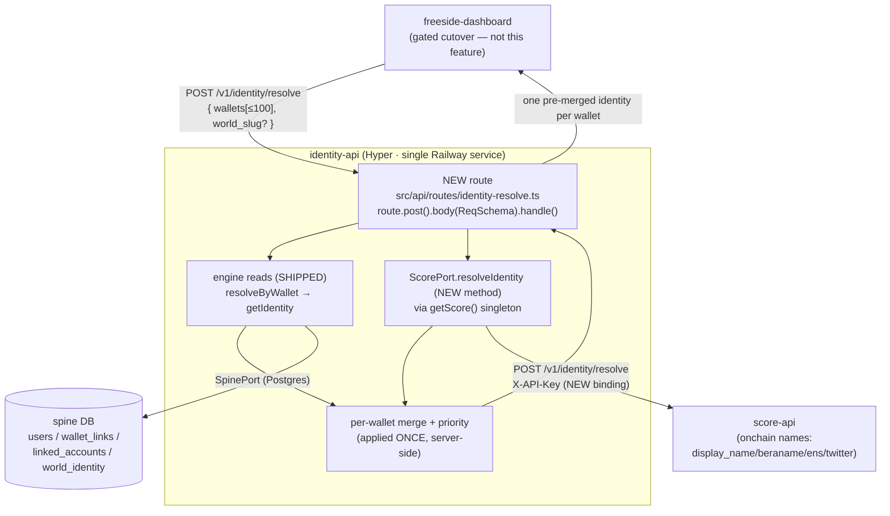
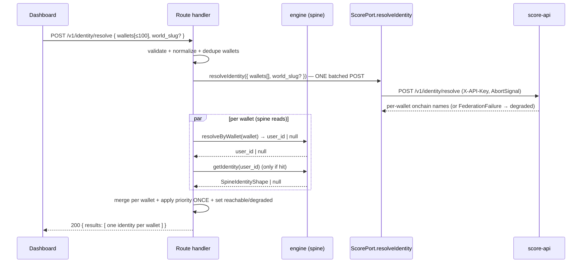
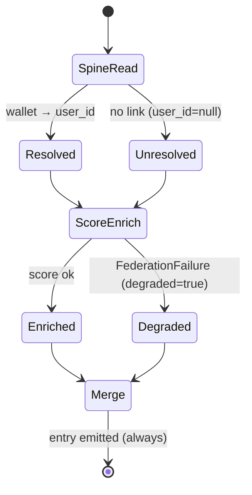

# Software Design Document: `POST /v1/identity/resolve` — Merge Facade

**Version:** 1.0
**Date:** 2026-06-01
**Author:** Architecture Designer Agent
**Status:** Grounded v1.1 — OQ-2 resolved against the score-api checkout (2026-06-01). Planning gate CLOSED per operator; build gate = Loa `/sprint-plan` → `/run` (implement→review→audit). Flatline not run on the SDD (operator decision 2026-06-01).
**Scope:** FEATURE-SCOPED. This SDD designs ONLY the v1 server-side merge facade
(`POST /v1/identity/resolve`) under PRD v3.0 goal **G-5** (read-time compose, no-embed),
delivered as bead `bd-2wo.38`. It does NOT (re)architect the identity-api SoR — the spine,
ES256 signer/JWKS, svc-JWT verify, credential bridges, and the existing `GET /v1/profile`
compose are all SHIPPED and out of scope.
**PRD Reference:** `grimoires/loa/prd.md` (§4.5 G-5, §5 NFRs)
**Requirements Reference:** GitHub `0xHoneyJar/identity-api#32` (ratified 2026-06-01) + the posted
ratification comment + bead `bd-2wo.38`. **Requirements are RATIFIED — this SDD formalizes the
agreed design, it does not re-open the contract.**

---

## Table of Contents

1. [Feature Architecture](#1-feature-architecture)
2. [Software Stack](#2-software-stack)
3. [Data Design (read-only — no schema changes)](#3-data-design-read-only--no-schema-changes)
4. [Consumer / UI Contract Bridge](#4-consumer--ui-contract-bridge)
5. [API Specifications](#5-api-specifications)
6. [Error Handling & Degradation Strategy](#6-error-handling--degradation-strategy)
7. [Testing Strategy](#7-testing-strategy)
8. [Development Phases](#8-development-phases)
9. [Known Risks and Mitigation](#9-known-risks-and-mitigation)
10. [Open Questions (held-open)](#10-open-questions-held-open)
11. [Appendix](#11-appendix)

---

## 1. Feature Architecture

### 1.1 System Overview

The merge facade is a single new server-side endpoint that lets a consumer (the
`freeside-dashboard`) hand identity-api a batch of wallet addresses and receive **one
pre-merged identity per wallet** — so the consumer re-derives nothing.

> From PRD v3.0 §4.5 (G-5/D8): "`getProfile(user_id|wallet, world_slug)` JOINs spine +
> holdings + score + world content … composition is **live-join only**" (`prd.md:L187-189`).

This facade is the *resolve-batch sibling* of the already-shipped `GET /v1/profile`
compose (`src/api/routes/profile.ts`). Where `/v1/profile` composes ONE subject across
inventory + score + codex, this facade composes a BATCH of wallets across exactly two
sources — the **local spine** (read-of-record) and **score-api** (onchain-name enrichment) —
and applies the display-name priority server-side ONCE.

**The merge is server-side and the priority is applied once.** That is the entire value
proposition: the dashboard stops carrying merge logic, beraname>ENS>twitter chains, and
score/identity coupling. It receives a flat per-wallet record and renders it.

### 1.2 Architectural Pattern

**Pattern:** Backend-for-Frontend (BFF) merge facade over a fan-in of two read sources
(local DB read + one outbound federated HTTP call), per wallet, batched.

**Justification:**

- The dashboard needs a *merged* view; today it would have to call `/v1/identity/:userId`
  AND score-api AND apply priority itself. Centralizing the merge in identity-api keeps the
  **score-vs-identity boundary** intact (identity-api owns the grouping SoR; score-api
  enriches per-wallet and is never the grouping authority) and gives every future consumer
  one shape.
- It reuses the existing federation-fan-out machinery (`FederationResult` discriminated
  union, never-throws contract, per-source degraded handling) already proven in
  `composeProfile` / `src/api/routes/profile.ts`. No new architectural primitive is
  introduced.
- It is **additive**: a new port METHOD on the existing `ScorePort`, a new HTTP binding on
  the existing `HttpScoreAdapter`, and one new route registered in the existing app
  composition. Zero changes to the spine, signer, or auth path.

### 1.3 Component Diagram



### 1.4 System Components

This feature ships **TWO bounded components** (per `bd-2wo.38`).

#### Component 1 — `ScorePort.resolveIdentity` (port method + adapter binding)

- **Purpose:** Federate-read score-api's *identity* surface (group-aware onchain names),
  distinct from the already-wired *scores* surface.
- **What exists today (do NOT duplicate):** `ScorePort.getScore` (`packages/ports/src/score.port.ts:84`)
  bound to `GET /v1/wallets/:address` (scores-only) via `HttpScoreAdapter.getScore`
  (`packages/adapters/src/http-score-adapter.ts:100-116`). The singleton accessor
  `getScore()` (`src/api/score.ts:42`) already builds the adapter from
  `SCORE_API_URL` / `SCORE_API_KEY`.
- **What is NEW:**
  - `ScorePort.resolveIdentity(input, opts?): Promise<FederationResult<ScoreResolveIdentityResp>>`
    added to the port interface.
  - `HttpScoreAdapter.resolveIdentity(...)` implementing it via the existing
    `federationHttpCall({ method: "POST", body, responseSchema, ... })`
    (`packages/adapters/src/federation-http.ts:106` already supports POST + body).
  - A sealed Zod response schema in `packages/protocol/src/api/federation/score.ts`
    (sibling to `ScoreGetWalletRespSchema`), `.loose()` for forward-compat. **Grounded shape
    (2026-06-01 — score-api `src/routes/identity.ts:25-37`, `types/dynamic.types.ts:94-132`):**
    the response is a **KEYED MAP** `{ identities: Record<lowercased-wallet, ResolvedIdentity> }`
    — NOT an array. `ResolvedIdentity = { wallet, display_name (non-null), ens_name|null,
    beraname|null, basename|null, twitter_handle|null, pfp_url|null, twitter_source|null }`.
    The facade consumes `display_name` + `beraname`/`ens_name`/`twitter_handle`; it does **NOT**
    surface score's `basename`/`pfp_url`/`twitter_source` in v1 (not in the ratified #32 contract).
    The request body is `{ wallets }` **only** (no `world_slug` — score-api is wallet-only,
    EVM `0x+40hex`, batch ≤100, auth-gated `X-API-Key`).
- **Interfaces exposed:** the port method (consumed by the route only).
- **Dependencies:** `federation-http.ts` transport; `@freeside-auth/protocol/api/federation/score`
  for the response schema. Same building, same `X-API-Key` auth (`SCORE_API_KEY_HEADER`,
  `http-score-adapter.ts:57`), no new infra.
- **Contract (inherited from ScorePort, `score.port.ts:66-82`):** READ-ONLY; **never throws**;
  failures return `{ ok: false, reason: FederationFailure }`; `AbortSignal` forwarded for
  per-source timeout; 404 → `not_found`, 401 → `unauthorized`, 429 → `rate_limited` (breaker-exempt),
  5xx → `upstream_5xx`, schema drift → `parse_error`.

#### Component 2 — `POST /v1/identity/resolve` route (the merge facade)

- **Purpose:** Accept `{ wallets[], world_slug? }`, fan-in spine read + score enrich per
  wallet, merge, apply priority, return one record per wallet.
- **Pattern B (T1.10 convention):** request/response Zod schemas live in
  `packages/protocol/src/api/identity-resolve.ts` (new file), re-exported from
  `packages/protocol/src/api/index.ts`; the route is
  `route.post("/v1/identity/resolve").body(ReqSchema).meta({...}).handle(...)` in
  `src/api/routes/identity-resolve.ts` (new file); registered in the `.use([...])` array at
  `src/api/index.ts:74-93`.
- **Responsibilities:**
  1. Validate the batch (≤100 wallets, EIP-55/hex format, dedupe).
  2. For each wallet: `resolveByWallet(getSpine(), wallet)` → if hit, `getIdentity(getSpine(), user_id)`.
  3. For each wallet: call `getScore().resolveIdentity(...)` for onchain-name enrichment
     (batched into ONE score-api POST of ≤100 wallets — see §1.5).
  4. Merge per wallet; apply priority ONCE: `world_nym > discord(id-only) > score display_name > address`.
  5. Set `reachable` tri-state, `is_primary_wallet`, and per-wallet `degraded`.
- **Interfaces exposed:** `POST /v1/identity/resolve` (HTTP + OpenAPI; MCP opt-in via `meta.mcp`).
- **Dependencies:** engine reads (`resolveByWallet`, `getIdentity` — `@freeside-auth/engine`,
  used today by `src/api/routes/resolve.ts:100,201`); `getScore()` singleton (`src/api/score.ts`);
  protocol schemas.

#### Untouched components (HARD constraint — no creative latitude)

The following are **out of scope and MUST NOT be modified**: the ES256 signer
(`LocalEs256Signer`), JWKS (`/.well-known/jwks.json`), the svc-JWT verify path,
`/v1/auth/verify` + the `CredentialBridge`. The facade adds NO onchain name resolution to
identity-api — that lives in score-api (per the score-vs-identity boundary).

### 1.5 Data Flow



**Merge rule per wallet (server-side, applied ONCE):**

```
display_name (FINAL) =
  world_nym                       (world_identities[world_slug].nym, if world_slug given & present)
  ELSE discord id-only label      (linked_accounts[provider=discord].external_id present → discord tier)
  ELSE score-api display_name     (ONLY if score reached AND score resolved a REAL onchain name —
                                   i.e. beraname OR ens_name OR twitter_handle is non-null. See ▼)
  ELSE address                    (the wallet itself — always-available fallback)
display_source = which tier won ("world_nym" | "discord" | "score" | "address")
```

> Boundary guard: the facade consumes score-api's `display_name` as a SINGLE tier. It does
> NOT re-implement `beraname > ENS > twitter` resolution — `beraname` / `ens_name` /
> `twitter_handle` are RAW PASSTHROUGH tooltip fields only. That chain is score-api's job
> (score-vs-identity boundary, per repo `CLAUDE.md` hard rules).
>
> ▼ **Grounded (2026-06-01): score-api `display_name` is NEVER null** — it self-truncates to
> the wallet (`computeDisplayName`, score-api `services/identity.service.ts:68-78`) when no
> onchain name exists. So the `score` tier fires ONLY when score resolved a REAL name
> (`beraname`/`ens_name`/`twitter_handle` non-null); otherwise the facade falls through to the
> `address` tier. This reads the passthrough fields for PRESENCE only (not to rank/construct a
> name) — boundary intact. Keeps `display_source="address"` a real, honest outcome.
> (Operator decision 2026-06-01: "real onchain name only".)
>
> v2 forward-compat (per #11 comment 2026-06-01): score-api's `twitter_handle` is *scraped
> from Dynamic* (the provider #11 replaces). When twitter becomes a first-class identity-api
> `linked_accounts` provider (OAuth-verified, mirroring `/v1/link/discord/*`), the facade
> SHOULD prefer the **identity-linked** twitter over the score-scraped one (verified > inferred)
> and `display_source` gains a `"twitter"` tier above `"score"`. Design the `twitter_handle`
> field + the priority chain so this SOURCE-FLIP is non-breaking — same field, source changes,
> precedence shifts. v1 keeps score's value as the only twitter source; the migration to
> score-api-as-pure-scoring stays invisible to consumers. Tracked: `bd-2wo.39`.

**Discord shape:** `{ id, linked }` only — the spine has **no username/handle column**
(`packages/adapters/src/migrations/0001_init_spine.up.sql:67-74`: `linked_accounts` is
`(provider, external_id, verified_at, unlinked_at)`). `id` = the discord `external_id`;
`linked` = whether an active (un-unlinked) discord row exists.

**Grouping authority:** `is_primary_wallet` and any grouping come from the spine
(`wallet_links.is_primary`, surfaced via `SpineIdentityShape.wallets[].is_primary`,
`packages/ports/src/spine.port.ts:38-73`). score-api enriches per-wallet and is **never** the
grouping authority.

### 1.6 External Integrations

| Service | Purpose | API Type | Auth | Source |
|---------|---------|----------|------|--------|
| score-api | onchain-name enrichment (group-aware display_name/beraname/ens/twitter) per wallet | REST `POST /v1/identity/resolve` (batch ≤100) | `X-API-Key` header | `packages/adapters/src/http-score-adapter.ts:57`; `https://score.0xhoneyjar.xyz` default (`DEFAULT_SCORE_BASE_URL:51`) |
| spine (Postgres) | identity SoR read (user_id, wallets, primary, discord, world nym) | in-process via `SpinePort` | n/a (local) | `getIdentity`/`resolveByWallet` (`@freeside-auth/engine`) |

> The score-api `POST /v1/identity/resolve` is the **onchain name chain** endpoint. The
> existing wired client is bound to `GET /v1/wallets/:address` (scores-only) — this is a
> NEW binding to a DIFFERENT score-api endpoint, same building and same auth.

**[GROUNDED 2026-06-01 — OQ-2 RESOLVED]** score-api exposes `POST /v1/identity/resolve`
(`src/routes/identity.ts:25-37`, auth-gated `X-API-Key` via `index.ts:90`). **Request:**
`{ wallets: string[] }` — EVM `0x+40hex` only, `.min(1).max(100)`, **no `world_slug` param**.
**Response:** a **KEYED MAP** `{ identities: Record<lowercased-wallet, ResolvedIdentity> }` (NOT
an array — `types/dynamic.types.ts:130-132`), where every requested wallet is guaranteed present
(empty-name fallback, `services/identity.service.ts:253-261`). `ResolvedIdentity =
{ wallet, display_name (non-null), ens_name|null, beraname|null, basename|null,
twitter_handle|null, pfp_url|null, twitter_source|null }`. Resolution is **group-aware**
(`resolve_wallet_group` RPC → first-non-null-wins across the wallet group). The
N-parallel-call fallback (old Risk R-3) is therefore NOT needed — one batched POST suffices;
the route looks up `resp.identities[wallet.toLowerCase()]`.

### 1.7 Deployment Architecture

Single Railway service (`identity.0xhoneyjar.xyz`), unchanged (PRD NFR-3, `prd.md:L217`). The
facade adds one route to the existing Hyper app; no new process, container, or env var beyond
the already-present `SCORE_API_URL` / `SCORE_API_KEY` (`src/api/score.ts:30-31`). Optionally
a per-deploy timeout knob (see §2.2).

### 1.8 Scalability Strategy

- **Batch bound:** ≤100 wallets per request (hard cap, validated; mirrors the score-api
  batch bound). A request over 100 → `400 invalid_param`.
- **Fan-out shape:** spine reads are N in-process Postgres queries (sub-100ms p95 per
  PRD NFR-1, `prd.md:L215`); score enrichment is ONE batched outbound HTTP POST (not N) —
  the dominant latency term, bounded by a per-source AbortSignal timeout.
- **No new persistence, no cache in v1** (Simplicity First — the spine reads are already
  fast and the score call is single-flight per request). A response cache is a future
  optimization, explicitly NOT in v1 scope.

### 1.9 Security Architecture

- **Auth:** identity-api's existing route auth posture applies (the app installs
  `authJwtPlugin`, `src/api/index.ts:65-70`). **[ASSUMPTION]** this facade follows the same
  caller-auth posture as the sibling read endpoints (`/v1/profile`, `/v1/resolve/*` use
  `route` without `.auth()` for spine reads); confirm during T-A2 whether the dashboard
  caller must present a bearer/svc-JWT. If a protected posture is required, add `.auth()` —
  but do NOT touch the verify implementation itself (hard constraint).
- **Outbound auth:** `X-API-Key` to score-api via the existing adapter config; the key is
  read from env at singleton build (`src/api/score.ts:31`) and never logged (the adapter logs
  only `hasApiKey: boolean`, `http-score-adapter.ts:114`).
- **Input validation:** wallets validated against the EIP-55/hex regex
  (`WalletAddressParamSchema`, `packages/protocol/src/api/resolve.ts:26-28`); `world_slug`
  against `WorldSlugParamSchema` (`resolve.ts:42-44`). Batch length capped at 100.
- **No secret/PII leakage:** discord `external_id` is an opaque id (no username); score raw
  fields are passthrough. No new sensitive surface.

---

## 2. Software Stack

No new runtime dependencies. The feature uses the existing stack verbatim.

### 2.1 Backend Technologies

| Category | Technology | Version | Justification |
|----------|------------|---------|---------------|
| Runtime | Bun | repo-pinned | existing (`import.meta.main`, `src/api/index.ts:129`) |
| HTTP framework | `@hyper/core` | repo-pinned | existing route builder + `jsonResponse` (`src/api/routes/profile.ts:13`) |
| Schema/validation | Zod | `^4.4.3` | existing protocol package pin (`packages/protocol/package.json`); `.loose()` for forward-compat federation schemas (`federation/score.ts:104-107`) |
| Federation transport | `federation-http.ts` | in-repo | existing; supports `method:"POST"` + `body` (`federation-http.ts:106,130-141`) |
| Spine access | `@freeside-auth/engine` | in-repo | existing `resolveByWallet` / `getIdentity` |

### 2.2 Configuration

| Var | Purpose | Default | Source |
|-----|---------|---------|--------|
| `SCORE_API_URL` | score-api base URL | `https://score.0xhoneyjar.xyz` | `src/api/score.ts:30`, `DEFAULT_SCORE_BASE_URL` |
| `SCORE_API_KEY` | `X-API-Key` value | (unset → calls return `unauthorized`, surfaced as degraded) | `src/api/score.ts:31` |
| `IDENTITY_RESOLVE_SCORE_TIMEOUT_MS` *(NEW, optional)* | per-source AbortSignal budget for the score enrich call | e.g. 600ms | new; wired into the route's AbortController |

> Naming note: `IDENTITY_RESOLVE_URL` (mentioned in `bd-2wo.38`) is a **CONSUMER-side** env
> on the dashboard, not a server var — see §4.

---

## 3. Data Design (read-only — no schema changes)

**No migrations. No schema changes.** This feature is a read/compose facade. It reads the
existing spine tables via the engine and stores nothing (No-embed invariant, PRD FR-P3
`prd.md:L189`).

### 3.1 Spine entities read (existing — `0001_init_spine.up.sql`)

| Entity | Fields read | Used for |
|--------|-------------|----------|
| `wallet_links` | `wallet_address`, `user_id`, `is_primary`, `unlinked_at` | wallet→user_id resolve; `is_primary_wallet` flag |
| `linked_accounts` | `provider='discord'`, `external_id`, `unlinked_at` | `discord.{id, linked}` (NO username — col doesn't exist, `0001:67-74`) |
| `world_identity` | `world_slug`, `nym` | `world_nym` priority tier (when `world_slug` given) |
| `users` | `user_id`, `primary_wallet` | identity anchor (via `SpineIdentityShape`) |

All four are surfaced together by the engine `getIdentity(userId) → SpineIdentityShape`
(`packages/ports/src/spine.port.ts:66-73`):

```ts
interface SpineIdentityShape {
  readonly user_id: string
  readonly primary_wallet: string | null
  readonly wallets: readonly SpineWallet[]            // .is_primary, .wallet_address
  readonly linked_accounts: readonly SpineLinkedAccount[]  // .provider, .external_id, .unlinked_at
  readonly world_identities: readonly SpineWorldIdentity[] // .world_slug, .nym
}
```

### 3.2 Data access pattern

| Query | Per request | Optimization |
|-------|-------------|--------------|
| `resolveByWallet(wallet)` | up to 100 (one per wallet) | covered by `uq_wallet_links_active_address` (`0001:51-53`) |
| `getIdentity(user_id)` | up to 100 (only for resolved wallets) | covered by `idx_wallet_links_user`, `idx_linked_accounts_user`, `idx_world_identity_user` (`0001:62,80,102`) |

> **[ASSUMPTION]** these run as N sequential/parallel point reads. Given prod scale today
> (5 users / 3 nyms per `bd-2wo.38`) this is non-issue; if a future batch-resolve engine
> helper exists it MAY be used, but v1 reuses the shipped single-subject readers per
> Simplicity First. (Open optimization, not a blocker — see R-2.)

### 3.3 `reachable` tri-state

`reachable: true | false | unknown`. **v1 returns `unknown` for the wallet-only majority** —
the population field that distinguishes reachable from unreachable is populated by issue #11
(P1), not yet landed. Today's prod coverage is tiny (5 users / 3 nyms). The facade ships the
tri-state shape now so the contract is stable; `unknown` is the honest default until #11.

---

## 4. Consumer / UI Contract Bridge

This feature has **no first-party UI**. The consumer is `freeside-dashboard`. Two coupling
rules, both already decided in `bd-2wo.38`:

### 4.1 Contract-first bridge (`IDENTITY_RESOLVE_URL`)

The dashboard wires against the **shape** via a consumer-side `IDENTITY_RESOLVE_URL` env with
**mock-fallback**: when unset/unreachable, the dashboard falls back to a local mock conforming
to the sealed response schema. This lets dashboard development proceed against the contract
before the server route is deployed. The server side ships the sealed Zod response schema
(`packages/protocol/src/api/identity-resolve.ts`) as the single source of truth for that mock.

### 4.2 Cutover is GATED (NOT this feature's concern)

> Build proceeds in **PARALLEL** with issue #11. The dashboard **CUTOVER** (pointing
> `IDENTITY_RESOLVE_URL` at the live endpoint) is **GATED** on #11 P1 + world-identity
> backfill coverage (prod today: 5 users / 3 nyms — backfill ran but spine coverage is tiny).
> Shipping this route does NOT trigger cutover. (`bd-2wo.38`)

---

## 5. API Specifications

### 5.1 Design principles

- **Style:** REST, JSON, wallet-keyed POST batch.
- **Versioning:** URL path (`/v1/`), consistent with all existing routes.
- **Pattern B:** schemas in `packages/protocol/src/api/identity-resolve.ts`, route uses
  `.body(ReqSchema)`. (Note: unlike `GET /v1/profile` whose `.body()` is a runtime no-op for
  GET — `profile.ts:53-56` — this is a real POST, so Hyper's `.body()` validation DOES run.)

### 5.2 Request schema (`IdentityResolveReqSchema`)

```ts
// packages/protocol/src/api/identity-resolve.ts
export const IdentityResolveReqSchema = z.object({
  wallets: z.array(WalletAddressParamSchema)   // reuse resolve.ts:26-28 — plain 0x+40hex, case-INSENSITIVE (NOT EIP-55 checksum)
    .min(1)
    .max(100),                                  // hard batch cap
  world_slug: WorldSlugParamSchema.optional(),  // reuse resolve.ts:42-44 — facade-internal (spine nym tier); NOT forwarded to score-api
})
```

> **Normalization (grounded):** `WalletAddressParamSchema` (`resolve.ts:26-28`) is
> `/^0x[a-fA-F0-9]{40}$/` — plain hex, **case-insensitive**, NOT EIP-55 checksum-enforcing.
> The route MUST lowercase-normalize each wallet (mirroring `resolveByWallet`'s
> `normalizeAddress`, `resolve-spine.ts:49-54`) before (a) spine resolve, (b) dedupe, and
> (c) score-map lookup (`resp.identities[wallet.toLowerCase()]` — score keys by lowercased
> wallet). Echo the normalized form in `results[].wallet` so the contract is order- AND
> case-stable.

### 5.3 Response schema (`IdentityResolveRespSchema`)

The **PINNED CONTRACT** per wallet (do not re-derive — ratified in #32):

```ts
export const IdentityResolveEntrySchema = z.object({
  wallet:           z.string(),                       // echo (normalized)
  user_id:          z.string().uuid().nullable(),     // null when wallet unresolved
  display_name:     z.string(),                       // FINAL merged name
  display_source:   z.enum(["world_nym", "discord", "score", "address"]),
  discord:          z.object({ id: z.string(), linked: z.boolean() }).nullable(),
  beraname:         z.string().nullable(),            // raw passthrough (tooltip)
  ens_name:         z.string().nullable(),            // raw passthrough (tooltip)
  twitter_handle:   z.string().nullable(),            // raw passthrough (tooltip)
  reachable:        z.enum(["true", "false", "unknown"]),  // tri-state; v1 → "unknown" majority
  is_primary_wallet: z.boolean(),                     // from spine wallet_links.is_primary
  degraded:         z.boolean(),                       // score enrichment unavailable for THIS wallet
})

export const IdentityResolveRespSchema = z.object({
  results: z.array(IdentityResolveEntrySchema),       // one entry per input wallet, order-stable
})
```

> `reachable` is a tri-state. Modeled here as a string enum `"true"|"false"|"unknown"` to
> make `unknown` explicit on the wire. **[ASSUMPTION — flag for review]** the alternative is
> `boolean | null` (`true`/`false`/`null=unknown`). The string-enum is recommended (a
> JSON boolean can't carry the third state without `null`, and `null` is ambiguous with
> "field absent"). This is a contract micro-decision for the Flatline gate to confirm.

### 5.4 Endpoint

| Method | Endpoint | Description | Auth |
|--------|----------|-------------|------|
| POST | `/v1/identity/resolve` | Batch-resolve wallets to pre-merged identities | per §1.9 (confirm at T-A2) |

**Request:**
```http
POST /v1/identity/resolve
Content-Type: application/json

{ "wallets": ["0xAbC…", "0xDeF…"], "world_slug": "mibera-world" }
```

**Response (200 OK):**
```json
{
  "results": [
    {
      "wallet": "0xabc…",
      "user_id": "11111111-1111-1111-1111-111111111111",
      "display_name": "honeybadger",
      "display_source": "world_nym",
      "discord": { "id": "123456789012345678", "linked": true },
      "beraname": "honeybadger.bera",
      "ens_name": null,
      "twitter_handle": "@hb",
      "reachable": "unknown",
      "is_primary_wallet": true,
      "degraded": false
    },
    {
      "wallet": "0xdef…",
      "user_id": null,
      "display_name": "0xdef…",
      "display_source": "address",
      "discord": null,
      "beraname": null,
      "ens_name": null,
      "twitter_handle": null,
      "reachable": "unknown",
      "is_primary_wallet": false,
      "degraded": true
    }
  ]
}
```

The second entry shows the **two independent partial-failure axes**: `user_id: null` (no
spine link → falls through to `address`), and `degraded: true` (score enrichment missed for
that wallet). Both leave the batch 200 OK.

**Error response (400 — batch invalid):**
```json
{ "code": "invalid_param", "message": "wallets: max 100", "issues": [ … ] }
```
(mirrors the existing 400 envelope shape, `src/api/routes/profile.ts:81-86`,
`src/api/routes/resolve.ts:72-78`.)

### 5.5 score-api binding (Component 1 wire)

```ts
// HttpScoreAdapter.resolveIdentity — same shape as getScore (http-score-adapter.ts:100-116)
const url = `${this.baseUrl}/v1/identity/resolve`
return federationHttpCall<ScoreResolveIdentityResp>({
  url, method: "POST",
  headers: this.defaultHeaders,            // includes X-API-Key
  body: { wallets },                       // batch ≤100, EVM 0x+40hex — NO world_slug (score is wallet-only)
  responseSchema: ScoreResolveIdentityRespSchema,  // NEW sealed schema: { identities: Record<wallet, ResolvedIdentity> } .loose()
  portOpts: opts,                          // forwards AbortSignal
  logger: this.logger,
  building: "score-api",
  context: { walletCount: wallets.length, hasApiKey: this.apiKey !== undefined },
})
```

---

## 6. Error Handling & Degradation Strategy

The governing invariant: **one bad wallet must never fail the batch; a score outage must
never fail the batch.** This mirrors `composeProfile`'s never-5xx-on-downstream-miss contract
(`src/api/routes/profile.ts:1-11`) and score-api's own per-source error capture.

### 6.1 Two independent partial-failure axes



| Axis | Failure | Entry effect | Batch effect |
|------|---------|--------------|--------------|
| Spine | wallet not linked | `user_id=null`, falls through priority to `address` | 200, entry present |
| Score | `FederationResult.ok===false` (timeout/401/404/5xx/parse) | `degraded=true`, score-derived fields (`display_name` if `score` would have won, `beraname`/`ens`/`twitter`) → null/fallback | 200, entry present |

> **Score degrade is per-BATCH, not per-wallet.** Component 1 makes ONE batched POST, and
> score-api guarantees every requested wallet is present in the response map (empty-name
> fallback). So there is no per-wallet score 404: either the single call succeeds (ALL entries
> `degraded=false`, each enriched — some possibly with no real onchain name) or it fails (ALL
> entries `degraded=true`). `degraded` is computed once and applied uniformly across the batch.

### 6.2 Error categories

| Category | HTTP | Trigger | Handling |
|----------|------|---------|----------|
| Validation | 400 | >100 wallets, bad hex, bad world_slug | reject whole request (Zod `.body()` + envelope) |
| Score degrade | (none — 200) | score-api unreachable/4xx/5xx/timeout | ALL entries `degraded=true` (score is ONE batched call — degrade is per-batch, not per-wallet); **never propagates** |
| Spine miss | (none — 200) | wallet not linked | per-wallet `user_id=null`, `display_source="address"` |
| Spine I/O failure | 500 | real Postgres outage (engine throws non-`not_found`) | propagate to global error handler — the spine is the SoR substrate (NFR-2: isolation degrades compose, NOT the spine itself; `profile.ts:120-130`, `prd.md:L216`) |

> Decision: a `resolveByWallet`/`getIdentity` that THROWS (real DB I/O error, not a miss) is a
> 5xx — same posture as `composeProfile` which throws only on spine failure and maps the 3
> known not-found kinds to 404 (`profile.ts:120-130`). A *miss* (null) is NOT an error; it's
> the `address`-fallback path.

### 6.3 Per-source timeout & breaker

- The route creates an `AbortController` with `IDENTITY_RESOLVE_SCORE_TIMEOUT_MS`, passes
  `{ signal }` into `resolveIdentity` → forwarded to `fetch` (`federation-http.ts:139`). Abort
  due to the caller signal → `{ ok:false, reason:{ kind:"timeout" } }` → `degraded=true`.
- **v1 does NOT add a circuit breaker for this route** (Simplicity First). `composeProfile`
  uses per-source breakers because it's a high-traffic single-subject path; this batch facade
  is low-traffic (gated cutover, tiny prod). A breaker MAY be added later by reusing the
  `CircuitBreaker` already imported in `profile.ts:42-46` — noted, not built. (Flag for the
  Flatline gate: confirm omitting the breaker is acceptable given the single batched call.)

### 6.4 Logging

Structured logs via the adapter's `FederationLogger` (already wired). `degraded` reasons map
to the `FederationFailureKind` taxonomy (`packages/ports/src/federation-result.ts:56-64`).
Never log the `X-API-Key` (only `hasApiKey`).

---

## 7. Testing Strategy

Test-first. Each component lands with tests before wiring (Karpathy Goal-Driven).

### 7.1 Testing pyramid

| Level | Coverage target | Tools | What |
|-------|-----------------|-------|------|
| Unit | merge/priority + degrade logic 100% | Bun test | the priority resolver (pure function), `reachable` derivation, discord shape |
| Adapter | `resolveIdentity` classification | Bun test + `MockScorePort` / `fetchImpl` injection | 200/401/404/429/5xx/parse/timeout → correct `FederationResult` |
| Integration | route end-to-end | Bun test against booted app (ephemeral port, `src/api/index.ts:129` test seam) + `__setScoreForTest` (`src/api/score.ts:49`) | batch happy path, mixed partial failure, ≤100 bound, 400s |

### 7.2 Mandatory test cases (acceptance criteria)

1. **Priority — each tier wins in order:** world_nym present → `display_source="world_nym"`;
   no nym but discord linked → `"discord"`; neither but score display_name → `"score"`;
   nothing → `"address"`.
2. **No beraname/ENS/twitter re-derivation:** when score returns all three, `display_name`
   still follows the 4-tier rule; `beraname`/`ens_name`/`twitter_handle` are echoed raw and
   do NOT influence `display_source`.
3. **Discord shape:** resolves to `{ id: external_id, linked: true }`; soft-unlinked
   (`unlinked_at` set) → `linked:false` (or `discord:null` per resolved policy — confirm).
   Never a `username`/`handle` field.
4. **Partial failure — spine miss for one wallet:** a batch of 3 where wallet #2 has no spine
   link (the batched score call succeeds) → 200, entry #2 has `user_id=null`,
   `display_source="address"` (no nym/discord, and score has no real onchain name for it),
   `degraded=false`; entries #1/#3 unaffected. (Score degrade is per-BATCH — see case 5 — so a
   single wallet cannot be `degraded` while its siblings are not.)
5. **Score outage — whole-source degrade:** score-api times out for the batch → all entries
   `degraded=true`, spine-derived tiers (world_nym/discord/address) still resolve, 200 OK.
6. **Batch bound:** 101 wallets → 400; 0 wallets → 400; 100 wallets → ok.
7. **`reachable` tri-state:** v1 → `"unknown"` for the wallet-only majority (assert the
   default until #11 lands).
8. **`is_primary_wallet`:** sourced from spine `is_primary`, not from score.
9. **world_slug scoping:** omitted world_slug → world_nym tier never selected (skips straight
   to discord); present world_slug with no matching nym → also skips.
10. **Score tier requires a REAL onchain name (operator decision — "real name only"):** score
    reached, `display_name` present but `beraname`/`ens_name`/`twitter_handle` ALL null (score
    self-truncated to the wallet) → `display_source="address"`, NOT `"score"`; `degraded=false`.
    Conversely, ANY one of the three non-null → `display_source="score"` with score's
    `display_name`. Asserts the facade reads passthrough fields for PRESENCE only.
11. **score-api response is a keyed map:** the adapter resolves `resp.identities[wallet.toLowerCase()]`;
    a mixed-case input wallet still finds its score entry; the echoed `results[].wallet` is the
    normalized (lowercased) form.

### 7.3 CI integration

Runs in the existing Bun test suite on PR. No new CI infra.

---

## 8. Development Phases

This is a single-sprint feature (consumable by `bd-2wo.38` + `/sprint-plan`). No cycle-ledger
scaffolding required (the repo's cycle ledger is empty by design — work is beads-tracked).

### Phase A — Component 1: `ScorePort.resolveIdentity` + binding (T-A1, T-A2)
- [ ] **T-A1** Author `ScoreResolveIdentityReqSchema` + `ScoreResolveIdentityRespSchema` in
  `packages/protocol/src/api/federation/score.ts` (sealed, `.loose()`); re-export from
  `federation/index.ts` + `api/index.ts`. **Confirm score-api wire shape first** (R-3).
- [ ] **T-A1** Add `resolveIdentity` to `ScorePort` (`packages/ports/src/score.port.ts`) with
  the never-throws docstring contract; implement `HttpScoreAdapter.resolveIdentity` (POST via
  `federationHttpCall`). Tests: classification matrix (§7.2 adapter row).

### Phase B — Component 2: the route (T-B1, T-B2)
- [ ] **T-B1** Author `IdentityResolveReqSchema` + `IdentityResolveRespSchema` in
  `packages/protocol/src/api/identity-resolve.ts`; re-export from `api/index.ts`. Write the
  pure `mergeIdentity(spine, scoreEnrich, world_slug?)` priority resolver + its unit tests
  FIRST (§7.2 cases 1-3, 7-9).
- [ ] **T-B2** Author `src/api/routes/identity-resolve.ts` (Pattern B `post().body().handle()`):
  validate → spine reads (`resolveByWallet`/`getIdentity`) → ONE batched `getScore().resolveIdentity`
  → merge → respond. Register in `src/api/index.ts:74-93`. Integration tests (§7.2 cases 4-6).

### Phase C — Contract bridge handoff (T-C1)
- [ ] **T-C1** Confirm the sealed response schema is importable for the dashboard mock-fallback
  (`IDENTITY_RESOLVE_URL` consumer-side). Document the contract in the SDK surface. (Cutover
  itself is GATED on #11 — NOT in this sprint.)

### Out of this sprint (held)
- Dashboard cutover (gated on #11 P1 + backfill coverage).
- Issue #11 `reachable` population (parallel track).
- Response caching / circuit breaker for this route (future optimization).

---

## 9. Known Risks and Mitigation

| ID | Risk | Prob | Impact | Mitigation |
|----|------|------|--------|------------|
| **R-1** | Boundary creep — facade starts re-deriving beraname>ENS>twitter or coupling score grouping | Med | High | Hard rule in §1.5; test case §7.2#2 asserts no re-derivation; raw fields are passthrough-only. Flatline gate explicitly checks this. |
| **R-2** | N×2 spine reads per batch (up to 200 point reads at 100 wallets) | Low | Low | Prod scale tiny (5 users / 3 nyms); all reads index-covered (`0001:62,80,102`); batch capped at 100. Future: batch-resolve engine helper (not v1). |
| **R-3** | ~~score-api wire shape unconfirmed~~ — **RESOLVED 2026-06-01** | — | — | Grounded against the score-api checkout (§1.6): batched `POST /v1/identity/resolve` exists; response is a keyed map (not array); request is `{ wallets }` only; group-aware; every wallet guaranteed present. No N-call fallback needed. Adapter schema models the map. |
| **R-4** | `reachable` ships as `"unknown"` for nearly everyone until #11 | High | Low | Intentional + documented (§3.3); contract shape stable now, semantics fill in later. Parallel build is the agreed plan. |
| **R-5** | Auth posture for the dashboard caller is unconfirmed ([ASSUMPTION] §1.9) | Med | Med | T-A2 confirms; if protected, add `.auth()` only — NEVER touch the verify impl (hard constraint). |
| **R-6** | `reachable` on-wire encoding (`"true"|"false"|"unknown"` enum vs `boolean|null`) | Low | Low | §5.3 recommends string-enum; Flatline gate confirms before seal (cheap to change pre-deploy, expensive after a consumer vendors it — cf. NOTES "contract-change window OPEN"). |

---

## 10. Open Questions (held-open)

| ID | Question | Owner | Status |
|----|----------|-------|--------|
| **OQ-1** | Per-world nym vs unified cross-world `freeside-nym` | operator (identity-model) | **HELD OPEN** — future identity-model decision. v1 designs ONLY the `world_slug`-scoped path; `world_slug` is optional and scopes the nym tier. (`bd-2wo.38`) |
| **OQ-2** | ~~score-api wire shape~~ | T-A1 implementer | **RESOLVED 2026-06-01** — keyed map `{ identities: Record<wallet, ResolvedIdentity> }`; request `{ wallets }` only; group-aware; every wallet guaranteed present (§1.6). |
| **OQ-3** | Dashboard-caller auth posture (open read vs bearer/svc-JWT) | T-A2 implementer | Open — confirm; default to existing sibling-read posture |
| **OQ-4** | Soft-unlinked discord row → `linked:false` vs `discord:null` | T-B1 (resolver) | Open — policy micro-decision; default `linked:false` keeps the id visible |
| **OQ-5** | `reachable` wire encoding | operator (pinned) | **RESOLVED** — string-enum `"true"\|"false"\|"unknown"` (operator pin 2026-06-01; contract window open, no external consumers). |
| **OQ-6** | `score` tier when score reached but no real onchain name | operator | **RESOLVED 2026-06-01** — "real onchain name only": gate the `score` tier on `beraname`/`ens`/`twitter` presence; else fall to `address` (§1.5 ▼). |

---

## 11. Appendix

### A. Glossary

| Term | Definition |
|------|------------|
| Merge facade | Server-side endpoint that joins spine + score enrich and applies the display-name priority ONCE, returning one pre-merged identity per wallet. |
| Spine | identity-api's local Postgres SoR (users / wallet_links / linked_accounts / world_identity). |
| Enrichment | score-api's per-wallet onchain-name data (display_name/beraname/ens/twitter); identity-api consumes, never stores (No-embed). |
| display_source | Which priority tier produced the FINAL `display_name`: `world_nym` > `discord` > `score` > `address`. |
| Degraded (per-wallet) | score enrichment was unavailable for that wallet; spine-derived tiers still resolve; batch stays 200. |
| Score-vs-identity boundary | Doctrine: score-api owns onchain names/scoring; identity-api owns grouping/SoR. The facade consumes score's `display_name` as ONE tier and never re-derives the name chain. |

### B. Grounded source references

| Claim | Source |
|-------|--------|
| `ScorePort.getScore` is scores-only (`GET /v1/wallets/:address`) | `packages/ports/src/score.port.ts:84`, `packages/adapters/src/http-score-adapter.ts:100-116` |
| `federationHttpCall` supports POST + body | `packages/adapters/src/federation-http.ts:106,130-141` |
| `getScore()` singleton builds adapter from env | `src/api/score.ts:29-45` |
| `SpineIdentityShape` fields (the spine read) | `packages/ports/src/spine.port.ts:66-73` |
| linked_accounts has NO username column | `packages/adapters/src/migrations/0001_init_spine.up.sql:67-74` |
| FederationResult never-throws contract + failure kinds | `packages/ports/src/federation-result.ts:56-107` |
| Degrade-not-5xx + spine-throw→404 posture to mirror | `src/api/routes/profile.ts:1-11,120-130` |
| Pattern B (schema in protocol, route registered at index) | `packages/protocol/src/api/index.ts:8-13`, `src/api/index.ts:74-93` |
| EIP-55/hex + world_slug param regexes (reuse) | `packages/protocol/src/api/resolve.ts:26-28,42-44` |
| G-5 read-time compose, no-embed | `grimoires/loa/prd.md:L183-190` |
| NFR-1 (resolve<100ms), NFR-2 (isolation), NFR-3 (single Railway) | `grimoires/loa/prd.md:L215-217` |
| Ratified requirements | GitHub `0xHoneyJar/identity-api#32` + ratification comment; bead `bd-2wo.38` |

### C. Change Log

| Version | Date | Changes | Author |
|---------|------|---------|--------|
| 1.0 | 2026-06-01 | Initial feature-scoped SDD for `POST /v1/identity/resolve` merge facade (G-5 / bd-2wo.38) | Architecture Designer |
| 1.1 | 2026-06-01 | Pre-build grounding pass (5-agent verification vs the tree + score-api checkout). OQ-2 RESOLVED: score response is a keyed map `{ identities: Record<wallet, ResolvedIdentity> }` (not an array); request is `{ wallets }` only (no `world_slug`); `display_name` is never null → `score` tier gated on a REAL onchain name (OQ-6, operator "real-name-only"); score degrade is per-BATCH; wallet regex is plain hex → lowercase-normalize + dedupe + map lookup. OQ-5 pinned to string-enum. R-3/OQ-2 closed. Facade drops score's `basename`/`pfp_url`/`twitter_source` (not in ratified #32). | Build session (grounding) |

---

*Generated by Architecture Designer Agent. Next: adversarial/Flatline review (the gate).*
