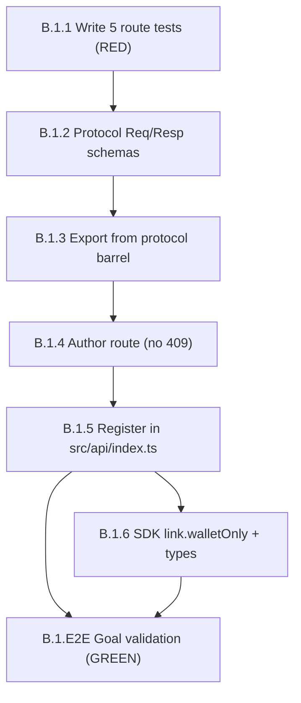

# Sprint Plan: `POST /v1/link/wallet-only` Route (Sprint B part 1)

**Version:** 1.0
**Date:** 2026-06-02
**Author:** Sprint Planner Agent
**Spec:** `grimoires/loa/specs/wallet-only-link-route.md`
**Branch:** `feat/wallet-only-link-route` (no push, no PR — coordinator reviews + opens the PR)

> **Note:** written as a dedicated named sprint file to preserve the prior
> `grimoires/loa/sprint.md` (the unrelated `/v1/identity/resolve` merge-facade plan).
> The ledger has `active_cycle: null` / `next_sprint_number: null`, so this is a
> standalone spec-driven sprint, not a globally-numbered cycle sprint.

---

## Executive Summary

A single SMALL sprint exposing the already-built, already-deployed `linkWalletOnly`
engine over HTTP as `POST /v1/link/wallet-only`. The route is a **verbatim clone of
the `linkVerifiedWallet` route minus the discord axis and minus the 409/collision
path**. This is an **auth-surface, service-token-gated, additive** endpoint — review +
audit are non-negotiable. Test-first.

**Total scope:** 5 deliverables, 1 sprint, ~6 technical tasks. No engine changes.
No DB needed for the route tests (mock-spine harness).

> From spec (`wallet-only-link-route.md:7`): "this route does not [have open
> questions] — it's a pure additive, service-token-gated endpoint."

> From spec (`wallet-only-link-route.md:39`): "❌ The engine
> (`link-wallet-only.ts`) … This is route + protocol + registration + tests only."

### Grounding ledger (every reference read before planning)

| Artifact | Path | Status (read 2026-06-02) |
|----------|------|--------------------------|
| Engine orchestrator | `packages/engine/src/link-wallet-only.ts:126-133` | EXISTS, prod-deployed — DO NOT TOUCH |
| Engine export | `packages/engine/src/index.ts:166-175` | `linkWalletOnly` + all types exported |
| Verified-wallet protocol (mirror src) | `packages/protocol/src/api/link.ts:21-47` | `LinkVerifiedWalletReqSchema`/`RespSchema` |
| Protocol barrel | `packages/protocol/src/api/index.ts:60-67` | verified-wallet export block |
| Verified-wallet route (mirror src) | `src/api/routes/link.ts:34-107` | `getServiceToken()`/`serviceTokenMatches()` helpers |
| API registration | `src/api/index.ts:51,91` | import + `.use([...])` array |
| Route test harness (mirror src) | `src/api/__tests__/link-route.test.ts` | mock-spine pattern; stubs `claimGeneratedName`/`importName` |
| SDK client | `packages/sdk/src/client.ts:139-147,256-269` | `link.verifiedWallet` method + `LinkVerifiedWalletOpts` |
| SDK types | `packages/sdk/src/types.ts:54-58` | `LinkVerifiedWalletReq`/`Resp` re-exports |
| Engine input shape | `packages/engine/src/link-wallet-only.ts:54-70` | `LinkWalletOnlyInput` + `ImportedName` field names |
| Engine result shape | `packages/engine/src/link-wallet-only.ts:100-112` | `LinkWalletOnlyResult` |
| Resolver outcomes | `packages/engine/src/link-wallet-only.ts:82-97` | `create_user | idempotent_noop` ONLY — no collision class |
| Audit emit (no discord) | `packages/engine/src/link-wallet-only.ts:197-208` | `event_type: "link_wallet_only"`, NO `discord_id` key |
| CI proof list | `.github/workflows/ci.yml:56-82` | default `bun test` step + DB-backed proof block |

---

## Sprint B.1: `POST /v1/link/wallet-only` HTTP Ingress

**Scope:** SMALL (6 technical tasks)

**Sprint Goal:** Expose the existing `linkWalletOnly` engine over HTTP as a
service-token-gated additive route that mirrors `linkVerifiedWallet` minus the
discord axis and minus the 409/collision path, validated test-first via the
mock-spine harness.

### Deliverables

- [ ] `LinkWalletOnlyReqSchema` + `LinkWalletOnlyRespSchema` (+ inferred types) authored in `packages/protocol/src/api/link.ts` and exported from `packages/protocol/src/api/index.ts`
- [ ] `linkWalletOnly` route in `src/api/routes/link.ts` (`POST /v1/link/wallet-only`) reusing the file's existing `getServiceToken()` / `serviceTokenMatches()` helpers — NO 409, NO collision try-catch
- [ ] Route registered in `src/api/index.ts` (import + `.use([...])` array) beside `linkVerifiedWallet`
- [ ] SDK `link.walletOnly(input, opts)` method + `LinkWalletOnlyReq`/`Resp` type re-exports added to `packages/sdk`
- [ ] 5 route tests in a new `src/api/__tests__/wallet-only-route.test.ts` using the mock-spine harness (503 / 401 / new-wallet-generated_name / idempotent-null / audit-no-discord) — all GREEN

### Acceptance Criteria

- [ ] **AC-1** `LinkWalletOnlyReqSchema` validates `{ worldSlug: /^[a-z0-9-]+$/, walletAddress: /^0x[a-fA-F0-9]{40}$/, dynamicUserId?: string, importedNames?: [{nameType, value}] }` and contains **NO `discordId` field** (ground: `link-wallet-only.ts:59-70` field names + spec `:14-15`)
- [ ] **AC-2** `LinkWalletOnlyRespSchema` validates `{ ok: literal(true), user_id: uuid, wallet_address: string, idempotent: boolean, generated_name: string|null }` (ground: spec `:16-17`, `LinkWalletOnlyResult` `link-wallet-only.ts:100-112`)
- [ ] **AC-3** `POST /v1/link/wallet-only` returns **503 `service_unconfigured`** when `LINK_SERVICE_TOKEN` is unset (mirror `link.ts:69-74`)
- [ ] **AC-4** Route returns **401 `unauthorized`** on missing or wrong `X-Service-Token` (mirror `link.ts:78-83`, constant-time compare via shared `serviceTokenMatches`)
- [ ] **AC-5** Route returns **200** with non-null `generated_name` on a new wallet (the `claimGeneratedName` path; `importedNames` absent) — `idempotent: false`
- [ ] **AC-6** Route returns **200** with `idempotent: true` and `generated_name: null` on a known wallet (`idempotent_noop` decision)
- [ ] **AC-7** Audit event `event_type: 'link_wallet_only'` is emitted with **NO `discord_id` key** in its payload (ground: `link-wallet-only.ts:197-208`)
- [ ] **AC-8** Route contains **NO 409 branch and NO collision try-catch** — handler is a straight `linkWalletOnly(getSpine(), body, { actor: 'wallet-only-ingress' })` call (ground: spec `:22`; resolver returns only `create_user | idempotent_noop`)
- [ ] **AC-9** SDK `client.link.walletOnly(input, opts)` compiles with full typing derived from the protocol schemas; mirrors `verifiedWallet`'s S2S header pattern (`x-service-token`)
- [ ] **AC-10** `bun test` is GREEN (new route test file picked up by the default suite — no DB required); `tsc` passes across `protocol`, `sdk`, and `src/api`

### Technical Tasks

- [ ] **Task B.1.1 — Write the 5 route tests FIRST** (test-first; they fail until the route exists) → **[G-1]**
  - New file `src/api/__tests__/wallet-only-route.test.ts`
  - Clone the harness shape from `src/api/__tests__/link-route.test.ts:21-154` (ephemeral `port:0`, `__setSpineForTest(buildMockSpine())`, `beforeEach` sets `LINK_SERVICE_TOKEN`, `afterAll` stops app + resets spine)
  - The mock spine already stubs `claimGeneratedName` (returns `"MIBERA-000001"`) and `importName` (`link-route.test.ts:89-92`) — reuse verbatim; `resolveByWallet` toggled via `resolveByWalletReturns`
  - `postWalletOnly()` helper POSTs to `/v1/link/wallet-only` with `{ worldSlug, walletAddress }` (NO `discordId`)
  - Five `it` cases mapping 1:1 to AC-3..AC-7:
    1. **503** when `delete process.env.LINK_SERVICE_TOKEN`
    2. **401** on `serviceToken: null` (missing) and on `serviceToken: "wrong"`
    3. **200 + non-null `generated_name`** — `resolveByWalletReturns = null` (new wallet), `importedNames` absent → assert `body.generated_name === "MIBERA-000001"`, `idempotent === false`, and a `claimGeneratedName` call was made
    4. **200 + `idempotent:true` + `generated_name:null`** — `resolveByWalletReturns = <existing-uuid>` → assert `idempotent === true` and `generated_name === null`
    5. **audit-no-discord** — assert `mockSpine.audits` contains `event_type === 'link_wallet_only'` AND that audit's payload has no `discord_id` key (`expect("discord_id" in audit.payload).toBe(false)`)

- [ ] **Task B.1.2 — Author the protocol schemas** in `packages/protocol/src/api/link.ts` (after `LinkVerifiedWallet*` schemas, ~`:62`) → **[G-1]**
  - `LinkWalletOnlyReqSchema = z.object({ worldSlug: z.string().regex(/^[a-z0-9-]+$/), walletAddress: z.string().regex(/^0x[a-fA-F0-9]{40}$/), dynamicUserId: z.string().min(1).optional(), importedNames: z.array(z.object({ nameType: z.string(), value: z.string() })).optional() })` — field names match `LinkWalletOnlyInput`/`ImportedName` EXACTLY (`link-wallet-only.ts:54-70`)
  - `LinkWalletOnlyRespSchema = z.object({ ok: z.literal(true), user_id: z.string().uuid(), wallet_address: z.string(), idempotent: z.boolean(), generated_name: z.string().nullable() })`
  - Export both schemas + `z.infer<>` types `LinkWalletOnlyReq` / `LinkWalletOnlyResp`

- [ ] **Task B.1.3 — Export schemas from the protocol barrel** `packages/protocol/src/api/index.ts` (beside the verified-wallet block `:60-67`) → **[G-1]**
  - Add `LinkWalletOnlyReqSchema`, `LinkWalletOnlyRespSchema`, `type LinkWalletOnlyReq`, `type LinkWalletOnlyResp` to the existing `from "./link"` export

- [ ] **Task B.1.4 — Author the route** in `src/api/routes/link.ts` → **[G-1]**
  - `import { linkWalletOnly as linkWalletOnlyOrchestrator } from "@freeside-auth/engine"` and `LinkWalletOnlyReqSchema as LinkWalletOnlyReq` (+ shape type) from `@freeside-auth/protocol/api`
  - `export const linkWalletOnly = route.post("/v1/link/wallet-only").body(LinkWalletOnlyReq).meta({...}).handle(async (c) => {...})`
  - **Reuse** the file's existing `getServiceToken()` (`:34-37`) + `serviceTokenMatches()` (`:46-51`) — do NOT duplicate them
  - 503 when `getServiceToken() === null` (mirror `:69-74`); 401 when `!serviceTokenMatches(provided, configured)` (mirror `:78-83`)
  - Handler body: `const result = await linkWalletOnlyOrchestrator(getSpine(), body, { actor: "wallet-only-ingress" })` then `return jsonResponse(200, { ok: true, user_id: result.userId, wallet_address: result.walletAddress, idempotent: result.idempotent, generated_name: result.generatedName })`
  - **NO try-catch, NO 409** — `firstClaimResolver` cannot produce a collision (ground: `link-wallet-only.ts:82-97`)

- [ ] **Task B.1.5 — Register the route** in `src/api/index.ts` → **[G-1]**
  - Add `linkWalletOnly` to the `from "./routes/link"` import (`:51`)
  - Add `linkWalletOnly` to the `.use([...])` array (`:91`), beside `linkVerifiedWallet`

- [ ] **Task B.1.6 — Extend the SDK** in `packages/sdk` → **[G-1]**
  - `types.ts:54-58`: add `LinkWalletOnlyReq`, `LinkWalletOnlyResp` to the `export type {...} from "@freeside-auth/protocol/api"` block; add `LinkWalletOnlyReqSchema`/`RespSchema` to the runtime-schema re-export (`types.ts:88-112`) if mirroring the verified-wallet runtime export
  - `client.ts`: import the new types (`:40-54`); add `walletOnly(input: LinkWalletOnlyReq, opts: LinkWalletOnlyOpts): Promise<LinkWalletOnlyResp>` to the `link` block of the `IdentityClient` interface (`:139-147`) and implement it in the factory (`:256-269`), reusing `LinkVerifiedWalletOpts` for the S2S `serviceToken` shape (or an aliased `LinkWalletOnlyOpts` if a distinct name is preferred), POSTing to `/v1/link/wallet-only`

- [ ] **Task B.1.E2E — End-to-End Goal Validation** (P0) → **[G-1]**
  - Run `bun test src/api/__tests__/wallet-only-route.test.ts` — all 5 cases GREEN
  - Run full `bun test` — no regressions in the existing `link-route.test.ts` or elsewhere
  - Run `tsc`/typecheck across `packages/protocol`, `packages/sdk`, `src/api` — clean
  - Confirm the engine file, trigger, `0009` migration, `merge-identity.ts`, `composeProfile`, and the backfill are **unmodified** (`git diff --stat` shows only the 5 intended files + the new test)

### Dependencies

- **Satisfied:** `linkWalletOnly` engine merged + deployed + backfilled (spec `:3` — "#34/#35 merged+deployed+backfilled; the gate is satisfied")
- **Internal task order:** B.1.1 (tests, fail) → B.1.2 → B.1.3 (protocol available) → B.1.4 (route compiles against protocol) → B.1.5 (route registered, tests can hit it) → B.1.6 (SDK) → B.1.E2E
- **External:** none. Sprint B part 2 (the mibera-dimensions rewire) is a **separate repo + separate PR with open operator questions** — explicitly out of scope (spec `:40`)

### Risks & Mitigation

| Risk | Likelihood | Mitigation |
|------|-----------|------------|
| Protocol field-name drift from `LinkWalletOnlyInput` (e.g. `nameType` vs `name_type`) → silent validation reject | Low | AC-1 grounds field names verbatim against `link-wallet-only.ts:54-70`; B.1.2 copies them exactly |
| Accidental re-implementation of `getServiceToken`/`serviceTokenMatches` instead of reuse → constant-time-compare regression (FAGAN iter-1 finding) | Low | B.1.4 explicitly reuses the existing same-file helpers; reviewer checks the diff adds no new crypto |
| Adding a phantom 409/collision branch by over-mirroring `linkVerifiedWallet` | Medium | AC-8 + B.1.4 forbid try-catch; resolver type (`link-wallet-only.ts:82-97`) proves no collision class exists |
| Route test mistakenly DB-gated (added to the `ci.yml` DB proof block) when the mock-spine harness needs no DB | Low | Mock-spine route tests run in the default `bun test` step — **NO `ci.yml` edit needed** (see Note below) |
| Engine touched inadvertently | Low | B.1.E2E `git diff --stat` gate confirms engine/trigger/migration/backfill unmodified |

### Success Metrics

- 5/5 new route tests GREEN; full `bun test` GREEN (no regressions)
- `tsc` clean across protocol + sdk + src/api
- `git diff --stat` touches exactly: `packages/protocol/src/api/link.ts`, `packages/protocol/src/api/index.ts`, `src/api/routes/link.ts`, `src/api/index.ts`, `packages/sdk/src/{client,types}.ts`, + new `src/api/__tests__/wallet-only-route.test.ts` — and NOTHING in `packages/engine/` or migrations
- Route exercisable: 503 (unconfigured) / 401 (bad token) / 200 new-wallet / 200 idempotent — all observable in tests

### Note on CI (grounded)

`.github/workflows/ci.yml` has two relevant steps: a default `bun test` (whole suite,
**no DB**, lines ~`:56-61`) and a **DB-backed proof block** (`:63-82`) that iterates
specific files needing `TEST_DATABASE_URL=…/identity_ci`. The wallet-only **route**
tests use the **mock-spine harness** (no `withTransaction` against real PG, no
migration) — they belong in the default `bun test` step, which already discovers all
`*.test.ts`. **No `ci.yml` edit is required.** (The spec's "add to the proof list"
clause is conditioned on "if DB-gated" — spec `:36,43`. The existing DB-gated proof
`link-wallet-only-trigger.test.ts` is the *engine* trigger test, already listed at
`ci.yml:76`.)

---

## Appendix A: Task Dependency Flow

## Appendix B: What NOT to Touch (from spec `:38-41`)

- ❌ Engine `packages/engine/src/link-wallet-only.ts`
- ❌ The trigger / `0009` migration, `merge-identity.ts`, `composeProfile`, the backfill
- ❌ The dimensions rewire (Sprint B part 2 — separate repo, separate PR, open questions)
- ❌ No `git push`, no PR — coordinator reviews and opens the PR; stay on `feat/wallet-only-link-route`

## Appendix C: Goal Traceability

The spec is a single deferred build-task, not a multi-goal PRD. One synthesized
delivery goal governs the sprint:

| ID | Goal | Validation |
|----|------|------------|
| **G-1** | Expose `linkWalletOnly` over HTTP as a service-token-gated additive route, mirroring `linkVerifiedWallet` minus discord + minus the 409 path, validated test-first | B.1.E2E: 5 route tests GREEN + full suite GREEN + tsc clean + `git diff --stat` proves engine untouched |

**Goal → Task mapping:** G-1 ← B.1.1, B.1.2, B.1.3, B.1.4, B.1.5, B.1.6, B.1.E2E (every task contributes to G-1).

- ✅ No goal lacks a contributing task.
- ✅ Final sprint includes an E2E validation task (B.1.E2E, P0).
