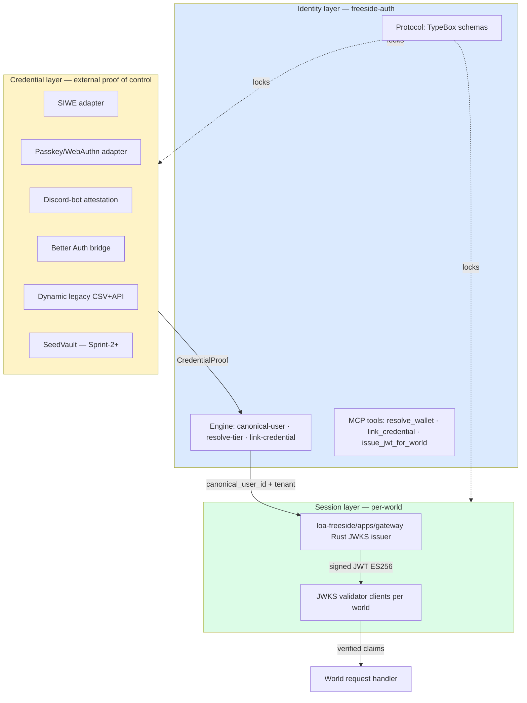
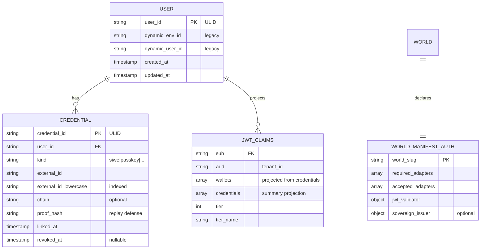

# freeside-auth — Software Design Document

> Sovereign identity module. Phase 2 of c-then-b hybrid migration. The substrate spec the runbook reads.
> KRANZ persona: terse, telemetry-driven, threshold-based. The SDD is the substrate-of-record map; sprint-plan is the procedure.

## §0 · Coordinate (read the room before committing)

### 0.1 Substrate state — what's real on disk today (2026-04-30)

| Substrate | Path | Lines | State | Action |
|---|---|---|---|---|
| **JWKS validator (TS)** | `loa-freeside/packages/adapters/agent/s2s-jwt-validator.ts` | 288 | LIVE | Direct extraction → `runtime/adapters/jwks-validator.ts` |
| **JWT issuer (TS, gateway-side)** | `loa-freeside/packages/adapters/agent/jwt-service.ts` | 215 | LIVE | Mirror claims shape into `protocol/jwt-claims.schema.ts`. NOT extracted — issuer stays. |
| **Resolve-wallet (4-tier)** | `mibera-dimensions/lib/server/resolve-wallet.ts` | 332 | LIVE on Supabase | Extract algorithm → `runtime/engine/resolve-tier.ts`; replace I/O with port calls |
| **midi onboarding** | `mibera-dimensions` (writer) | n/a | LIVE | NOT touched — midi stays single-writer of profile data |
| **Rust JWKS gateway** | `loa-freeside/apps/gateway/` | n/a | BUILT, untested by world consumers | Issuer endpoint locked under @janitooor |
| **In-bot freeside_auth proxy** | `freeside-ruggy/apps/bot/src/agent/freeside_auth/` | n/a | LIVE in ruggy V0.5-D | Replaced by `mcp-tools/resolve_wallet` post-publish |
| **freeside-auth scaffold** | `0xHoneyJar/freeside-auth` (commit `46aeee1`) | README-only | EMPTY — 6 dirs, README stubs only | All code is net-new under this SDD |
| **Sprawl Dashboard auth dir** | (expected) `apps/dashboard/src/lib/server/auth/` | — | **NOT FOUND on local fs (2026-04-30)** | **Audit gap. Coordinate with Sprawl team before Mirror.** Flagged in §6 runbook DEP-5. |
| **Dynamic CSV** | `~/Downloads/export-d5e7f445-c537-4d7a-9fb0-a35afc42dc30.csv` | 98,320 rows | IMMUTABLE SNAPSHOT | Source for `runtime/adapters/dynamic-csv-translator.ts` |

**Telemetry, not opinion:**
- `s2s-jwt-validator.ts:7-12` declares the cache discipline: `Fresh: < 1h → serve cached / Stale: 1h–72h → background refresh, serve stale on failure / Rejected: > 72h stale without successful refresh → hard reject / Unknown kid: force refresh (respects 60s cooldown) / Single-flight dedup`. PRD NFR-2.1 mirrors this exactly. **Do not invent — extract.**
- `jwt-service.ts:142-170` shows the issuer's actual claims. PRD FR-3.1 lists `sub, wallets[], credentials[], tenant_id, tier, pool_id, exp, iss, aud, iat, jti`. Substrate also has `nft_id, tier_name, access_level, allowed_model_aliases, allowed_pools, platform, channel_id, idempotency_key, req_hash, pool_mapping_version, contract_version, delegated_by, v`. **Audit finding: PRD claims shape is a SUBSET. Surface in §11 Decisions Log.**
- `resolve-wallet.ts:1-7` declares `import "server-only"` + raw client (throws on outage) — extraction must preserve outage-safety semantics; the `hold` terminal state is load-bearing.

### 0.2 Audit findings cited (PRD provenance preserved)

| Finding | PRD ref | Action in SDD |
|---|---|---|
| Six apps, six auth strategies, zero JWKS consumers | PRD §1.1 | §6 vertical slice = first JWKS consumer (Sprawl Dashboard) |
| Per-world heterogeneity is first-class | PRD §1.3 LOCKED | §3 + §4 — `world-manifest.auth` declaration drives adapter set per world |
| Three-layer split (credential / identity / session) | PRD §2.2 LOCKED | §1 architecture; §11 ADR-039 outline |
| JWKS issuance stays at loa-freeside/apps/gateway | PRD DEC-LOCK-10 | §3.4 — validator extraction; issuer untouched |
| Profile data stays in midi | PRD DEC-LOCK-11 | §3.5 — pg-mibera-profiles is a READER; no schema changes there |
| Score-vs-identity boundary | PRD DEC-LOCK-3 | §1.3 ECS placement; no factor data in any schema below |
| Codex review: collapse 6 → 3 packages | PRD DEC-AUTO-8 | §2 package layout (protocol + runtime + mcp-tools) |
| Anti-scope §22: over-design package cardinality | PRD ANTI-22 | §2 honors collapse |
| `auth-unification-seed/02-current-state-audit.md:386-405` Drift vs Documented Architecture | PRD §1.1 | §11 ADR-039 supersedes ADR-003 + ADR-038 |

### 0.3 Registry facts — apps in scope

| App | Current auth | Touched in V1? | Adapter required |
|---|---|---|---|
| Sprawl Dashboard | SIWE v3 + Turso | **YES (vertical slice)** | siwe + better-auth + jwks-validator |
| Sprawl Rektdrop | viem only | NO | — |
| Mibera Honeyroad | Dynamic v4.41.1 | NO (Sprint-2+) | dynamic-legacy (read-only) |
| Mibera Dimensions | Dynamic v4.67.2 + JWKS-RSA | NO (Sprint-2+) | dynamic-legacy + pg-mibera-profiles |
| Constructs Explorer | Dynamic v4.61.3 + Convex | NO (Sprint-2+) | — |
| Purupuru / World | Convex (passkey?) | NO (Sprint-2+) | — |
| loa-freeside gateway | JWKS issuer (Rust) | NO (untouched issuer) | — |
| freeside-ruggy bot | in-bot freeside_auth proxy | YES (consumer cutover post-publish) | mcp-tools/resolve_wallet |

### 0.4 Coordinate gate — GO/NO-GO before Mirror

```
☐ PRD ratified (signed off by operator) — DONE 2026-04-30
☐ Substrate-of-record audit complete — DONE (§0.1 above)
☑ @janitooor sign-off on jwt-claims schema mirror — OPEN (DEP-1)
☑ @soju Railway DB read access — OPEN (DEP-8)
☐ Sprawl Dashboard auth dir confirmed live — DONE 2026-04-30 (see §0.5 Amendment 1)
☑ Better Auth POC committed (3-day timebox, Sprint-0.5) — OPEN (DEC-OPEN-1, RSK-7)
```

**The gate is YELLOW. Three items remain open. SDD ships; sprint-plan honors the gate.**

### 0.5 Coordinate Amendment 1 (2026-04-30) — Sprawl Dashboard substrate path resolved

Post-SDD substrate audit completed. The Sprawl Dashboard repo and auth dir are LIVE; audit-named path (2026-04-16) is stale. KRANZ AP2 was correctly invoked; corrected path now of record.

| | audit (2026-04-16, stale) | substrate (2026-04-30, live) |
|---|---|---|
| repo dir | `~/Documents/GitHub/sprawl-world/` | `~/Documents/GitHub/world-sprawl/` |
| dashboard app | `apps/dashboard/` | `apps/freeside-dashboard/` |
| auth dir | `src/lib/server/auth/` | `src/lib/server/auth/` (same, under new app path) |

**Reason for drift**: org-wide `sprawl-world → world-sprawl` rename + `apps/dashboard → apps/freeside-dashboard` per 2026-04-28 prefix flip (memory: `freeside-* modules + world-prefix renames LIVE`). Audit predates the rename.

**Files of record (substrate-of-record, verified 2026-04-30)**:
- `world-sprawl/apps/freeside-dashboard/src/lib/server/auth/siwe.ts`
- `world-sprawl/apps/freeside-dashboard/src/lib/server/auth/session.ts`
- `world-sprawl/apps/freeside-dashboard/src/lib/server/auth/middleware.ts`
- `world-sprawl/apps/freeside-dashboard/src/lib/server/auth/csrf.ts` + `csrf.test.ts` + `session.test.ts`
- `world-sprawl/apps/freeside-dashboard/src/routes/api/auth/{nonce,verify,revoke}/+server.ts`
- `world-sprawl/apps/freeside-dashboard/src/routes/login/siwe-client.ts`

**Affected SDD references**: §0.1 substrate row, §6 vertical slice runbook (DEP-5 wording), DEC-SDD-3 (audit gap closes).

**Cycle lesson candidate** (D-N distillation hook): "Audit-named paths are stale by default after org rename events; run substrate-of-record audit before Mirror, not before SDD." → propose append to construct-freeside `anti_patterns_v0_4` as AP8 in cycle retro.

Coordinate gate item #5 closes GREEN. Three items remain (janitooor, soju, Better Auth POC).

### 0.6 Coordinate Amendment 2 (2026-05-01) — GWK research synthesis + positioning sharpened

Operator-directed reference dig on Dynamic Global Wallet Kit (https://www.dynamic.xyz/blog/dynamic-global-wallet-kit) completed 2026-05-01. Findings synthesized at `grimoires/research-dynamic-gwk-2026-05-01.md` (durable artifact, citation-grounded).

**Three positioning insights:**

1. **GWK has NO public JWT/OIDC story.** GWK's "cross-app" primitive is "your wallet appears in their wallet picker" via RainbowKit/ConnectKit/WalletConnect. That's wallet-UX, not session portability. The JWT/JWKS spine is the layer GWK NEVER BUILT. **freeside-auth fills exactly this gap.**

2. **Dynamic acquired by Fireblocks ~$90M (Oct 2025).** Roadmap optimized for fintech/enterprise custody-to-consumer. Indie builder roadmap deprioritized. Validates "no Dynamic in net-new" anti-scope but **softens the framing**: Dynamic credential UI stays a legitimate per-world option (FR-2.6 refined); we refuse Dynamic as the spine, not as a credential adapter.

3. **DX/UX is the explicit differentiator.** Operator framing 2026-05-01: "make it very, very seamless." NFR-4.4 added: external builder scaffolds own brand on freeside-auth in <60 min. Standard JWKS/OIDC surface (NFR-1.6); no consumer-side SDK adoption forced (ANTI-24).

**Triggered amendments**:
- PRD FR-2.6 refined (Dynamic = per-world adapter, not "legacy-migration only")
- PRD NFR-1.6 NEW (external surface = standard JWKS/OIDC)
- PRD NFR-4.4 NEW (DX bar: <60min external scaffold)
- PRD ANTI-23 NEW (don't conflate wallet-discovery with cross-app session)
- PRD ANTI-24 NEW (no consumer-side SDK adoption forced)
- PRD ANTI-25 NEW (don't try to out-build Dynamic's multi-chain wallet UI)
- SDD §1.4 NEW ("What freeside-auth is NOT" — GWK boundary)
- SDD §4.5 refined (Dynamic as per-world adapter, not just legacy)

**Coordinate gate state unchanged**: still YELLOW (3 items: janitooor RSK-9-deferred, soju Railway, Better Auth POC). The amendments do not change Mirror-readiness; they sharpen positioning.

**Distillation hook candidate D-N**: "credential-adapter-as-substrate-not-as-spine" — pattern observed when integrating with hosted wallet providers (Dynamic, Privy, Reown). Cycle retro promotion candidate.

**Process note**: dig-search.ts (Gemini-backed) returned 403 PERMISSION_DENIED on all fallback models 2026-05-01; fell back to Agent WebSearch + WebFetch per CLAUDE.md fallback protocol. Failure logged in seed §15 + memory.

---

## §1 · Architecture overview

### 1.1 Three-layer split (locked invariant)



**Boundary discipline:**
- Credential adapters NEVER mint user_ids. Engine mints.
- Engine NEVER signs JWTs. Gateway signs.
- Validator clients NEVER call gateway per-request. JWKS cache is the contract.

### 1.2 ECS placement (per `vault/wiki/concepts/ecs-architecture-freeside.md`)

| | Role | Owner |
|---|---|---|
| **Entity** | `User` (canonical, ULID) | freeside-auth |
| **Entity** | `Wallet` (chain-scoped) | score-mibera (NOT this module) |
| **Component** | `IdentityComponent` (credentials[], handle, tenant) | freeside-auth |
| **Component** | `FactorEvent` (score's domain) | score-mibera |
| **System** | `AuthSystem` — resolve, link, issue | freeside-auth |
| **System** | `ScoreSystem` — factor compute | score-mibera |

`User.wallets[]` is the JOIN seam between AuthSystem and ScoreSystem. **Never embed factor data in IdentityComponent. Never embed credential proofs in score's wallet entity.** Per DEC-LOCK-3.

### 1.3 Composition surface — freeside-as-subway

Per `vault/wiki/concepts/freeside-as-subway.md`: identity is a **component** attached to worlds, not a mandate. Each world's `world-manifest.yaml` declares which adapters are accepted/required.

```yaml
# Example world manifest fragment (FR-4.1)
world: sprawl-dashboard
auth:
  required: [siwe, better-auth]
  accepted: [siwe, better-auth, passkey]
  jwt_validator:
    issuer: arrakis
    audience: sprawl-dashboard
    jwks_url: https://gateway.freeside.sh/.well-known/jwks.json
```

```yaml
world: mibera-dimensions
auth:
  required: [dynamic-legacy]  # legacy phase
  accepted: [dynamic-legacy, siwe, passkey]
  jwt_validator:
    issuer: arrakis
    audience: mibera-dimensions
    jwks_url: https://gateway.freeside.sh/.well-known/jwks.json
```

```yaml
# External world (post-launch FR-4.3)
world: external-pumpkin-castle
auth:
  required: [seed-vault]  # Solana sovereign
  accepted: [seed-vault, siwe]
  jwt_validator:
    issuer: arrakis
    audience: external-pumpkin-castle
    jwks_url: https://gateway.freeside.sh/.well-known/jwks.json
  # External world MAY declare its own issuer — substrate honors heterogeneity
  sovereign_issuer:
    enabled: false  # opt-in; default false (use Freeside issuer)
```

### 1.4 What freeside-auth is NOT (GWK boundary, refined 2026-05-01)

Per research synthesis at `grimoires/research-dynamic-gwk-2026-05-01.md`:

> **freeside-auth is not a Dynamic Global Wallet Kit competitor at the credential layer — it's the identity/session layer GWK never built. The wallet-UX layer can remain Dynamic (or Reown AppKit, or Privy) on a per-world basis; freeside-auth owns the JWT/canonical-user spine that GWK leaves to "the wallet itself."**

The boundary, explicit:

| layer | who owns it | freeside-auth role |
|---|---|---|
| **wallet-UX** (multi-chain widget, 500+ wallets, brand picker) | Dynamic / Reown AppKit / Privy / per-world choice | **does NOT replicate** (ANTI-25) |
| **credential proof** (SIWE sig, passkey assertion, Dynamic JWT) | external libs | **bridges via adapter pattern** (FR-2.1..2.6) |
| **identity** (canonical user_id + credentials[] graph) | freeside-auth | **owns** (FR-1) |
| **session** (Freeside JWT for cross-world use) | freeside-auth → loa-freeside Rust gateway issues; freeside-auth ships validator | **owns spine; gateway issues** (FR-3) |
| **TEE custody, txn simulation, MFA** | Dynamic / hardware vendors | **does NOT replicate** (V1; revisit Sprint-3+ if substrate need surfaces) |

GWK conflates layers 1-4 into "the wallet"; freeside-auth keeps them separated. That separation is the architecture differentiator and the basis for NFR-1.6 (external builder surface = standard JWKS/OIDC, no SDK adoption required on consumer side).

### 1.5 Package cardinality (per DEC-AUTO-8 — collapse 6 → 3)

```
@freeside-auth/protocol     — sealed schemas (TypeBox JSON Schema), versioned
@freeside-auth/runtime      — engine + ports + adapters (collapse — adapters bind ports inline)
@freeside-auth/mcp-tools    — agent surface (resolve_wallet, link_credential, issue_jwt_for_world)
```

`ui/` package deferred until freeside-dashboard identity tab is real. **Codex review issue 6 honored** (PRD §14.6).

---

## §2 · Schema specs (substrate-extracted, not invented)

All schemas live in `@freeside-auth/protocol`, written in TypeBox (TS) and exported as JSON Schema. Schema governance per `packages/protocol/VERSIONING.md`: enum-locked `schema_version`, additive-only minor bumps, major bump = new file + migration plan (NFR-5.1–5.3).

### 2.1 `User` (canonical user)

```typescript
// @freeside-auth/protocol/user.schema.ts
import { Type, Static } from '@sinclair/typebox'

export const SCHEMA_VERSION = '1.0.0'  // enum-locked per NFR-5.1

export const User = Type.Object({
  schema_version: Type.Literal(SCHEMA_VERSION),
  user_id: Type.String({ pattern: '^[0-9A-HJKMNP-TV-Z]{26}$', description: 'ULID — DEC-AUTO-1' }),
  created_at: Type.String({ format: 'date-time' }),
  updated_at: Type.String({ format: 'date-time' }),
  // legacy reference — never deleted (FR-1.5, ANTI-12)
  dynamic_env_id: Type.Optional(Type.String({ description: '137aa286-922e-4308-835d-eb00d04b9f14 for THJ ecosystem' })),
  dynamic_user_id: Type.Optional(Type.String({ description: 'Original Dynamic user_id; preserved for rollback' })),
  // append-only relations — see Credential schema (NFR-1.5)
}, { $id: 'https://freeside.sh/schemas/user/1.0.0' })

export type UserT = Static<typeof User>
```

**Source provenance:** PRD FR-1.1 + DEC-AUTO-1 (ULID) + FR-1.5 (legacy preservation).

### 2.2 `Credential` (proof-of-control event, append-only)

```typescript
// @freeside-auth/protocol/credential.schema.ts
import { Type, Static } from '@sinclair/typebox'

export const CredentialKind = Type.Union([
  Type.Literal('siwe'),
  Type.Literal('passkey'),
  Type.Literal('discord-bot'),
  Type.Literal('telegram-bot'),
  Type.Literal('better-auth'),
  Type.Literal('dynamic-legacy'),
  Type.Literal('seed-vault'),  // Sprint-2+
])

export const Credential = Type.Object({
  schema_version: Type.Literal('1.0.0'),
  credential_id: Type.String({ pattern: '^[0-9A-HJKMNP-TV-Z]{26}$', description: 'ULID' }),
  user_id: Type.String({ pattern: '^[0-9A-HJKMNP-TV-Z]{26}$' }),
  kind: CredentialKind,
  // External identifier — chain address, passkey credential_id, discord_id, etc.
  external_id: Type.String(),
  external_id_lowercase: Type.String({ description: 'Indexed lookup key' }),
  // Optional chain scope for wallet credentials (FR-1.3)
  chain: Type.Optional(Type.String({ description: 'EIP-155 chain id, "solana", etc.' })),
  // Audit (NFR-1.5 append-only)
  linked_at: Type.String({ format: 'date-time' }),
  linked_via: Type.String({ description: 'Adapter id that minted this credential record' }),
  proof_hash: Type.String({ description: 'SHA-256 of original proof artifact (replay defense, NFR-1.2)' }),
  // Legacy preservation (FR-1.5)
  dynamic_env_id: Type.Optional(Type.String()),
  dynamic_credential_id: Type.Optional(Type.String()),
  // Revocation event (event-recorded, not row-mutated; NFR-1.5)
  revoked_at: Type.Optional(Type.String({ format: 'date-time' })),
  revoked_reason: Type.Optional(Type.String()),
}, { $id: 'https://freeside.sh/schemas/credential/1.0.0' })

export type CredentialT = Static<typeof Credential>
```

**Source provenance:** PRD FR-1.4 (composition not absorption), FR-1.6 (relinking via array, not user_id mutation), NFR-1.2 (proof-of-control lifecycle), NFR-1.5 (append-only).

### 2.3 `JwtClaims` (mirror Rust gateway exactly — substrate-of-record)

**Audit finding (§0.1):** the issuer in `loa-freeside/packages/adapters/agent/jwt-service.ts:142-170` mints MORE claims than PRD FR-3.1 enumerates. SDD names the full substrate; PRD subset is the **identity-relevant projection**.

```typescript
// @freeside-auth/protocol/jwt-claims.schema.ts
// MIRRORS loa-freeside/packages/adapters/agent/jwt-service.ts:142-170 — DO NOT INVENT.
import { Type, Static } from '@sinclair/typebox'

export const JwtClaims = Type.Object({
  // RFC 7519 standard
  iss: Type.Literal('arrakis'),  // jwt-service.ts:164 — issuer
  aud: Type.String({ description: 'World slug — jwt-service.ts:166 (currently "loa-finn"; per-world post-cutover)' }),
  sub: Type.String({ description: 'Canonical user_id (ULID) — jwt-service.ts:165' }),
  exp: Type.Integer(),
  iat: Type.Integer(),
  jti: Type.String({ format: 'uuid' }),

  // Identity-spine claims (load-bearing for freeside-auth consumers)
  tenant_id: Type.String({ description: 'World slug — jwt-service.ts:143' }),
  tier: Type.Integer({ minimum: 1, maximum: 9 }),
  tier_name: Type.String({ description: 'Cub/Worker/Scout/.../Oracle — jwt-service.ts:33-43' }),
  pool_id: Type.String(),

  // Multi-wallet projection (NEW — derived from Credential[])
  wallets: Type.Array(Type.Object({
    address: Type.String(),
    chain: Type.String(),
    credential_id: Type.String(),
  }), { description: 'Projected from Credential[] where kind in {siwe, dynamic-legacy, seed-vault} — derived per-issuance' }),

  credentials: Type.Array(Type.Object({
    credential_id: Type.String(),
    kind: Type.String(),
    linked_at: Type.String({ format: 'date-time' }),
  }), { description: 'Projected summary of Credential[] — kind + linked_at only; no proof artifacts' }),

  // Substrate claims (preserve from issuer — projected through, not invented here)
  nft_id: Type.Optional(Type.String()),
  access_level: Type.Optional(Type.String()),
  allowed_model_aliases: Type.Optional(Type.Array(Type.String())),
  allowed_pools: Type.Optional(Type.Array(Type.String())),
  platform: Type.Optional(Type.String()),
  channel_id: Type.Optional(Type.String()),
  idempotency_key: Type.Optional(Type.String()),
  req_hash: Type.Optional(Type.String()),
  pool_mapping_version: Type.Optional(Type.Integer()),
  contract_version: Type.Optional(Type.Integer()),
  delegated_by: Type.Union([Type.Null(), Type.String()]),

  // Schema version (per Bridgebuilder F-10, mirrored from jwt-service.ts:159)
  v: Type.Integer({ minimum: 1 }),
}, { $id: 'https://freeside.sh/schemas/jwt-claims/1.0.0' })

export type JwtClaimsT = Static<typeof JwtClaims>
```

**Distillation hook §9-A:** the schema mirror is a *contracts-as-bridges* pattern. The construct will distill the *"mirror, don't invent"* discipline as a reusable skill (`mirroring-substrate-claims`).

### 2.4 `WorldManifestAuth` (per-world auth declaration — FR-4)

```typescript
// @freeside-auth/protocol/world-manifest-auth.schema.ts
import { Type, Static } from '@sinclair/typebox'
import { CredentialKind } from './credential.schema.js'

export const JwtValidatorConfig = Type.Object({
  issuer: Type.String({ default: 'arrakis' }),
  audience: Type.String({ description: 'Per-world; binds tenant_id (FR-3.4)' }),
  jwks_url: Type.String({ format: 'uri' }),
  // Cache discipline — NFR-2.1, mirrors s2s-jwt-validator.ts:7-12
  jwks_cache_ttl_ms: Type.Integer({ default: 3_600_000 }),       // 1h fresh
  jwks_stale_max_ms: Type.Integer({ default: 259_200_000 }),     // 72h stale-if-error
  jwks_refresh_cooldown_ms: Type.Integer({ default: 60_000 }),   // 60s cooldown
  clock_tolerance_sec: Type.Integer({ default: 30 }),
})

export const SovereignIssuerConfig = Type.Object({
  enabled: Type.Boolean({ default: false }),
  issuer_url: Type.Optional(Type.String({ format: 'uri' })),
  jwks_url: Type.Optional(Type.String({ format: 'uri' })),
  // External world MAY declare its own JWT issuer (FR-4.3)
})

export const WorldManifestAuth = Type.Object({
  schema_version: Type.Literal('1.0.0'),
  required: Type.Array(CredentialKind, { minItems: 0 }),
  accepted: Type.Array(CredentialKind, { minItems: 1 }),
  jwt_validator: JwtValidatorConfig,
  sovereign_issuer: Type.Optional(SovereignIssuerConfig),
  // Operator escape hatch (NFR-3.3)
  break_glass_revocation_role: Type.Optional(Type.String()),
}, { $id: 'https://freeside.sh/schemas/world-manifest-auth/1.0.0' })

export type WorldManifestAuthT = Static<typeof WorldManifestAuth>
```

**Source provenance:** PRD FR-4.1–4.4, NFR-2.1 (cache mirror), NFR-3.3 (break-glass).

### 2.5 ER diagram



### 2.6 Postgres DDL (loa-freeside RDS — DEC-AUTO-5)

```sql
-- @freeside-auth/runtime/migrations/001_init.sql
-- Co-locates with issuer (gateway lives in loa-freeside RDS)

CREATE TABLE IF NOT EXISTS users (
  user_id            CHAR(26) PRIMARY KEY,                   -- ULID
  created_at         TIMESTAMPTZ NOT NULL DEFAULT NOW(),
  updated_at         TIMESTAMPTZ NOT NULL DEFAULT NOW(),
  dynamic_env_id     TEXT,
  dynamic_user_id    TEXT
);
CREATE INDEX idx_users_dynamic_user_id ON users(dynamic_user_id) WHERE dynamic_user_id IS NOT NULL;

CREATE TABLE IF NOT EXISTS credentials (
  credential_id            CHAR(26) PRIMARY KEY,            -- ULID
  user_id                  CHAR(26) NOT NULL REFERENCES users(user_id),
  kind                     TEXT NOT NULL CHECK (kind IN
    ('siwe','passkey','discord-bot','telegram-bot','better-auth','dynamic-legacy','seed-vault')),
  external_id              TEXT NOT NULL,
  external_id_lowercase    TEXT NOT NULL,
  chain                    TEXT,
  proof_hash               TEXT NOT NULL,
  linked_at                TIMESTAMPTZ NOT NULL DEFAULT NOW(),
  linked_via               TEXT NOT NULL,
  dynamic_env_id           TEXT,
  dynamic_credential_id    TEXT,
  revoked_at               TIMESTAMPTZ,
  revoked_reason           TEXT,
  -- Idempotency: same kind + external_id_lowercase + chain → unique active credential
  -- (NFR-3.2: concurrent first-credential resolutions converge)
  CONSTRAINT credentials_unique_active UNIQUE NULLS NOT DISTINCT
    (kind, external_id_lowercase, chain, revoked_at)
);
CREATE INDEX idx_credentials_user_id ON credentials(user_id);
CREATE INDEX idx_credentials_lookup ON credentials(kind, external_id_lowercase) WHERE revoked_at IS NULL;
CREATE INDEX idx_credentials_chain_lookup ON credentials(chain, external_id_lowercase) WHERE chain IS NOT NULL AND revoked_at IS NULL;

-- Audit log (NFR-4.1) — append-only event journal
CREATE TABLE IF NOT EXISTS auth_events (
  event_id        BIGSERIAL PRIMARY KEY,
  event_kind      TEXT NOT NULL CHECK (event_kind IN
    ('user_minted','credential_linked','credential_revoked','jwt_issued','session_revoked')),
  user_id         CHAR(26) REFERENCES users(user_id),
  credential_id   CHAR(26) REFERENCES credentials(credential_id),
  payload         JSONB NOT NULL,
  occurred_at     TIMESTAMPTZ NOT NULL DEFAULT NOW(),
  actor           TEXT,                                       -- adapter id or operator
  request_id      TEXT
);
CREATE INDEX idx_auth_events_user ON auth_events(user_id, occurred_at DESC);
CREATE INDEX idx_auth_events_kind ON auth_events(event_kind, occurred_at DESC);
```

**Idempotency design (NFR-3.2):** the `credentials_unique_active` constraint with `NULLS NOT DISTINCT` semantics treats `revoked_at IS NULL` as a single value, so two concurrent inserts of the same `(kind, external_id_lowercase, chain)` while both are unrevoked converge — the second hits a unique-violation, retries, finds the first, returns the existing user_id. **No duplicate users for the same external identifier under concurrency.**

---

## §3 · Engine + Ports

### 3.1 Engine surface (pure functions, port-driven I/O)

```typescript
// @freeside-auth/runtime/engine/canonical-user.ts
import { ulid } from 'ulid'
import type { UserT, CredentialT, CredentialKind } from '@freeside-auth/protocol'
import type { IUserRepo, ICredentialRepo, IAuthEventLog } from '../ports'

export interface MintArgs {
  proof: { kind: CredentialKindT; external_id: string; chain?: string; proof_hash: string; linked_via: string }
  tenant_id: string
  request_id: string
}

export async function resolveOrMintUser(
  args: MintArgs,
  deps: { users: IUserRepo; credentials: ICredentialRepo; events: IAuthEventLog }
): Promise<{ user: UserT; credential: CredentialT; minted: boolean }> {
  // Idempotent: (kind, external_id_lowercase, chain, revoked_at IS NULL) is unique.
  // 1. Look up existing active credential.
  // 2. If found → return user.
  // 3. Else → INSERT user (ULID) + credential in same tx.
  // 4. On unique violation → retry lookup (concurrent winner).
  // ... full impl deferred to /implement; logic shape above is contractual.
}

export async function linkCredential(
  user_id: string,
  proof: MintArgs['proof'],
  deps: { credentials: ICredentialRepo; events: IAuthEventLog }
): Promise<CredentialT> {
  // Append-only credential link to existing user (FR-1.6).
}

export async function revokeCredential(
  credential_id: string,
  reason: string,
  deps: { credentials: ICredentialRepo; events: IAuthEventLog }
): Promise<void> {
  // Event-recorded revocation; row gets revoked_at set, NOT deleted (NFR-1.5).
}
```

```typescript
// @freeside-auth/runtime/engine/resolve-tier.ts
// EXTRACTED from mibera-dimensions/lib/server/resolve-wallet.ts (332 lines).
// Algorithm preserved. I/O replaced by ports.
import type { IProfileLookup, IWalletGroupLookup } from '../ports'

export type ResolutionTier =
  | 'dynamic_user_id'      // Tier 1
  | 'additional_wallets'   // Tier 2
  | 'wallet_groups'        // Tier 3
  | 'direct'               // Tier 4
  | 'new_user'             // terminal
  | 'hold'                 // terminal — outage uncertainty

export interface ResolveResult {
  profileWallet: string
  isGrouped: boolean
  resolvedVia: ResolutionTier
  dynamicUserId?: string
  scoreApiReachable: boolean
}

export async function resolveProfileWallet(
  walletAddress: string,
  dynamicUserId: string | undefined,
  deps: { profiles: IProfileLookup; walletGroups: IWalletGroupLookup }
): Promise<ResolveResult> {
  // Tier 1: profiles.findByDynamicUserId(dynamicUserId)
  // Tier 2: profiles.findByAdditionalWallet(normalized)
  // Tier 3: walletGroups.lookup(normalized) → profiles.findByWallet(group.primaryWallet)
  // Tier 4: profiles.findByWallet(normalized)
  // Hold: dynamicUserId absent + walletGroups.unreachable → resolvedVia='hold'
  // New user: dynamicUserId present, all tiers empty → resolvedVia='new_user'
  //
  // Exact semantics per resolve-wallet.ts:56-331 — must preserve trust-validation
  // at Tier 3 (group.dynamicUserId === dynamicUserId or fall through; security: never
  // accept a group whose dynamicUserId mismatches the caller's claim).
}
```

```typescript
// @freeside-auth/runtime/engine/jwt-verify.ts
// EXTRACTED from loa-freeside/packages/adapters/agent/s2s-jwt-validator.ts (verify side only).
// JWKS fetched by adapter, key passed in.
import { jwtVerify, type KeyLike } from 'jose'
import type { JwtClaimsT } from '@freeside-auth/protocol'

export async function verifyToken(
  token: string,
  key: KeyLike | Uint8Array,
  expected: { issuer: string; audience: string; clockToleranceSec: number }
): Promise<JwtClaimsT> {
  const { payload, protectedHeader } = await jwtVerify(token, key, {
    issuer: expected.issuer,
    audience: expected.audience,
    algorithms: ['ES256'],
    clockTolerance: expected.clockToleranceSec,
  })
  if (protectedHeader.typ !== 'JWT') throw new Error('typ must be JWT (cross-protocol guard)')
  return payload as unknown as JwtClaimsT
}
```

### 3.2 Port interfaces

```typescript
// @freeside-auth/runtime/ports/index.ts
import type { UserT, CredentialT, CredentialKindT, JwtClaimsT } from '@freeside-auth/protocol'

export interface IUserRepo {
  findById(user_id: string): Promise<UserT | null>
  insert(user: UserT): Promise<void>
}

export interface ICredentialRepo {
  findActive(kind: CredentialKindT, external_id_lowercase: string, chain?: string): Promise<CredentialT | null>
  insert(cred: CredentialT): Promise<void>          // throws on unique violation (idempotency)
  revoke(credential_id: string, reason: string, at: Date): Promise<void>
  listByUser(user_id: string): Promise<CredentialT[]>
}

export interface IProfileLookup {
  findByDynamicUserId(dynamicUserId: string): Promise<{ wallet_address: string } | null>
  findByAdditionalWallet(wallet: string): Promise<{ wallet_address: string; dynamic_user_id: string | null }[]>
  findByWallet(wallet: string): Promise<{ wallet_address: string; dynamic_user_id: string | null } | null>
}

export interface IWalletGroupLookup {
  lookup(wallet: string): Promise<{
    primaryWallet: string | null
    wallets: string[]
    dynamicUserId: string | null
  }>
  // throws on network error (preserves resolve-wallet.ts:151 raw-client semantics)
}

export interface IJwksProvider {
  getKey(kid: string | undefined): Promise<KeyLike | Uint8Array>
}

export interface ICredentialBridge {
  readonly kind: CredentialKindT
  /** Verifies external proof, returns canonical proof artifact ready for engine.resolveOrMintUser */
  verifyProof(rawProof: unknown, ctx: { tenant_id: string; request_id: string }): Promise<{
    external_id: string
    chain?: string
    proof_hash: string
  }>
}

export interface IAuthEventLog {
  emit(event: {
    event_kind: 'user_minted' | 'credential_linked' | 'credential_revoked' | 'jwt_issued' | 'session_revoked'
    user_id?: string
    credential_id?: string
    payload: Record<string, unknown>
    actor?: string
    request_id?: string
  }): Promise<void>
}

export interface IIssueJwtForWorld {
  /** Calls loa-freeside/apps/gateway issuer endpoint POST /identity/resolve-and-issue */
  issue(args: {
    user_id: string
    tenant_id: string
    request_id: string
  }): Promise<{ jwt: string; expires_at: string; jti: string }>
}
```

### 3.3 Sequence — first-credential resolution + JWT issuance

```mermaid
sequenceDiagram
    participant World as World (e.g. Sprawl Dashboard)
    participant Adapter as CredentialBridge (siwe)
    participant Engine as freeside-auth Engine
    participant Repo as Postgres Repo
    participant GW as loa-freeside Rust Gateway
    participant Val as JWKS Validator (in World)

    World->>Adapter: verifyProof(SIWE message+sig)
    Adapter->>Adapter: Verify EIP-191 signature, nonce, exp
    Adapter-->>World: { external_id: 0x..., chain: 'eip155:8453', proof_hash }
    World->>Engine: resolveOrMintUser(proof, tenant_id, request_id)
    Engine->>Repo: findActive(siwe, 0x...lower, eip155:8453)
    Repo-->>Engine: null (first time)
    Engine->>Engine: ulid() → user_id
    Engine->>Repo: BEGIN; INSERT users; INSERT credentials; COMMIT
    Note over Repo: unique-violation retry on concurrent insert (NFR-3.2)
    Repo-->>Engine: { user, credential, minted: true }
    Engine->>Engine: emit(user_minted, credential_linked)
    Engine-->>World: { user, minted: true }
    World->>GW: POST /identity/resolve-and-issue { user_id, tenant_id, request_id }
    GW->>GW: Sign ES256 JWT with kid → JwtClaims (mirrors jwt-service.ts:142-170)
    GW-->>World: { jwt, expires_at, jti }
    World->>Val: verifyToken(jwt) on subsequent requests
    Val->>Val: getJwks() — cached 1h fresh / 72h stale-if-error / 60s cooldown
    Val-->>World: { claims }
```

### 3.4 Idempotency + concurrency strategy (NFR-3.2)

| Concern | Mechanism | Substrate ref |
|---|---|---|
| First-mint race for same (kind, external_id, chain) | Postgres unique constraint with `NULLS NOT DISTINCT`; on violation, retry SELECT | §2.6 DDL |
| JWKS thundering herd | `inflight: Promise<JwksResponse>` single-flight dedup | s2s-jwt-validator.ts:159-163 |
| JWKS cooldown bypass on first concurrent caller | Check inflight BEFORE cooldown gate | s2s-jwt-validator.ts:159-167 |
| Dynamic CSV translator re-runs | INSERT...ON CONFLICT DO NOTHING per (dynamic_user_id, dynamic_credential_id) | §4.7 below |
| JWT issuance retry safety | Idempotency-key scoped per (user_id, tenant_id, request_id); gateway responsibility | jwt-service.ts:153 |

### 3.5 Profile read boundary (DEC-LOCK-11)

The `IProfileLookup` port is satisfied by `pg-mibera-profiles.ts` (Railway PG read adapter). **freeside-auth NEVER WRITES to midi profile tables.** midi onboarding is the single writer. Per `~/Documents/GitHub/freeside-auth/CLAUDE.md:18`:
> "Schemas live here, profile DATA stays in midi. midi is the SINGLE WRITER."

If a future world needs to write profile data, it writes to its own Railway DB; freeside-auth's adapter set extends per RSK-3 (one adapter per world DB; common port).

---

## §4 · Adapters (per-credential bridges + repo bindings)

All adapters live in `@freeside-auth/runtime/adapters/`. **One file per concern. Adapters bind ports inline (DEC-AUTO-8 collapse).**

### 4.1 `credential-bridge-siwe.ts` (FR-2.1, mandatory)

- Implements `ICredentialBridge` with `kind: 'siwe'`.
- Source library: `siwe@3.0.0` (current Sprawl Dashboard version).
- `verifyProof`: validates EIP-191 message signature, checks `nonce`, `expirationTime`, `chainId`, `domain` against world manifest.
- Returns `{ external_id: address.toLowerCase(), chain: 'eip155:' + chainId, proof_hash: sha256(message+sig) }`.
- **Replay defense (NFR-1.2):** nonce store with 5-minute TTL; reject duplicate nonce.

### 4.2 `credential-bridge-passkey.ts` (FR-2.2)

- Implements `ICredentialBridge` with `kind: 'passkey'`.
- Source library: `@simplewebauthn/server@10.x`.
- `verifyProof`: validates assertion against stored `publicKey` + `counter`; increments counter post-verify.
- `external_id`: passkey credential_id (base64url).
- `chain`: undefined (chain-agnostic credential).

### 4.3 `credential-bridge-discord-bot.ts` (FR-2.3, NFR-1.3)

**Critical invariant (NFR-1.3):** the bot SIGNS attestation events; the bot DOES NOT MINT JWTs.

- Discord bot listens to a slash command (`/link-wallet`), receives a SIWE proof from the user via DM, signs an attestation envelope with bot's ES256 key, POSTs to `loa-freeside/apps/gateway` issuer endpoint.
- Issuer endpoint:
  1. Verifies bot attestation (bot's public key in JWKS).
  2. Verifies enclosed SIWE proof.
  3. Calls `engine.resolveOrMintUser` with `linked_via: 'discord-bot:<bot_id>'`.
  4. Returns JWT.
- **Bot key rotation policy (threat model §8):** monthly rotation; previous key valid for 24h overlap window; rotation logged to auth_events.
- `external_id`: discord user_id; `chain`: undefined.

### 4.4 `credential-bridge-better-auth.ts` (FR-2.5, POC-gated)

- **Sprint-0.5 POC required (DEC-OPEN-1, RSK-7):** verify Better Auth supports SIWE provider AND passkey; verify session token format compatible with bridging to Freeside JWT issuance.
- Adapter wraps Better Auth's session validation, extracts the verified credential, hands to engine.
- Sprawl Dashboard is the first consumer (vertical slice).
- **POC failure → fallback path:** see §11 DEC-OPEN-1 resolution + RSK-7 mitigation.

### 4.5 `credential-bridge-dynamic.ts` (FR-2.6, per-world credential adapter)

**Framing refined 2026-05-01 per GWK research synthesis** (`grimoires/research-dynamic-gwk-2026-05-01.md` §F + §G.1). Dynamic is NOT just a legacy-migration shim. Dynamic is a **per-world credential option** — its multi-chain wallet UI (500+ wallets) is genuinely strong infrastructure freeside-auth doesn't try to replicate. We refuse Dynamic as the **spine** (no Dynamic-issued JWT in net-new request paths); we accept it as a **credential adapter** that worlds opt into per `world-manifest.yaml`.

- Implements `ICredentialBridge` with `kind: 'dynamic'`.
- **Read-only on the auth path.** Does NOT call live Dynamic API for issuance. Reads from canonical user table (post-CSV import) and from Dynamic JWT claims passed via request header.
- ESLint rule `no-restricted-imports` blocks `@dynamic-labs/*` from default-import in net-new code; per-world manifests may explicitly opt in (`auth.adapters: [dynamic]` in `world-manifest.yaml`).
- Used in two flows:
  - **Migration flow (Sprint-2+ consumer cutover)**: Dynamic-authed user hits a Freeside-aware surface — adapter looks up canonical user by `dynamic_user_id` claim from the still-issued Dynamic JWT, hands user_id to engine, engine returns Freeside JWT.
  - **Per-world choice flow (post-Sprint-2)**: a world declares `dynamic` in its credential adapter manifest; uses Dynamic for wallet UI; freeside-auth issues the canonical Freeside JWT off the Dynamic-verified credential proof. **Wallet UX stays on Dynamic; spine is Freeside.**
- Treat as instance of D-N distillation pattern "credential-adapter-as-substrate-not-as-spine" → cycle retro candidate.

### 4.6 `jwks-validator.ts` (FR-3.5, direct extraction)

**Direct extraction from `loa-freeside/packages/adapters/agent/s2s-jwt-validator.ts` (288 lines).** Substrate-of-record. Preserve:
- ES256-only algorithm enforcement.
- `typ: 'JWT'` cross-protocol guard.
- 1h fresh / 72h stale-if-error / 60s refresh cooldown.
- Single-flight dedup (`inflight: Promise<JwksResponse>`).
- Unknown-kid → force refresh, single attempt.
- Logs via `Logger` interface (pino-compatible).

Preserve. Do not invent.

### 4.7 `dynamic-csv-translator.ts` (FR-5.1, NFR-2.3)

- One-time idempotent batch.
- Reads `~/Downloads/export-d5e7f445-c537-4d7a-9fb0-a35afc42dc30.csv` (38 cols, 98,320 rows, denormalized).
- Groups rows by `user_id` (Dynamic UUID); each group → 1 canonical user + N credentials.
- Per row, branches on `verified_credential_format`:
  - `blockchain` → kind=`dynamic-legacy`, chain=`eip155:` + (verified_credential_chain mapped), external_id=verified_credential_lowerAddress
  - `email` → kind=`dynamic-legacy`, sub-tag=email (preserved in `payload` of Credential.linked_via)
  - `oauth` → kind=`dynamic-legacy`, sub-tag=oauth (provider in linked_via)
- Idempotency: `INSERT...ON CONFLICT DO NOTHING` keyed on `(dynamic_user_id, dynamic_credential_id)` (preserved on Credential row).
- **Assertion before commit (NFR-2.3):** `output_credentials_count == input_csv_rows` (98,320 expected). Mismatch → halt, log diff, no partial commit.
- Performance target: < 5 minutes for 98,320 rows on a single connection. Substrate-of-record: no live Dynamic API calls.

### 4.8 Railway DB read adapters (FR-5.3)

- `pg-mibera-profiles.ts` (Railway env: `RAILWAY_MIBERA_DATABASE_URL`)
  - Implements `IProfileLookup` against `midi_profiles` table (read-only).
  - Preserves all 4 query patterns from `resolve-wallet.ts:56-331`.
- `pg-apdao.ts` (Railway env: `RAILWAY_APDAO_DATABASE_URL`)
  - Schema TBD per RSK-3 — one adapter per world DB.
- `pg-cubquest.ts` (Railway env: `RAILWAY_CUBQUEST_DATABASE_URL`)
  - Schema TBD per RSK-3.

**Sprint-1 ships pg-mibera-profiles only** (vertical slice doesn't touch apdao/cubquest). Stubs for the other two = port interface in place; concrete adapters in Sprint-2+.

### 4.9 `pg-canonical-user.ts` + `pg-credentials.ts` + `pg-auth-events.ts`

Direct Postgres bindings against the loa-freeside RDS canonical table (§2.6). Implements `IUserRepo`, `ICredentialRepo`, `IAuthEventLog`. Uses `pg` driver + connection pool.

### 4.10 Adapter registry table

| Adapter | File | Sprint | Status before this SDD |
|---|---|---|---|
| credential-bridge-siwe | `runtime/adapters/credential-bridge-siwe.ts` | 1 | not implemented |
| credential-bridge-passkey | `runtime/adapters/credential-bridge-passkey.ts` | 1 | not implemented |
| credential-bridge-discord-bot | `runtime/adapters/credential-bridge-discord-bot.ts` | 1 | not implemented |
| credential-bridge-better-auth | `runtime/adapters/credential-bridge-better-auth.ts` | 1 (POC-gated) | not implemented |
| credential-bridge-dynamic | `runtime/adapters/credential-bridge-dynamic.ts` | 1 (read-only) | not implemented |
| jwks-validator | `runtime/adapters/jwks-validator.ts` | 1 | extract from substrate |
| dynamic-csv-translator | `runtime/adapters/dynamic-csv-translator.ts` | 1 | not implemented |
| pg-mibera-profiles | `runtime/adapters/pg-mibera-profiles.ts` | 1 | not implemented |
| pg-apdao | `runtime/adapters/pg-apdao.ts` | 2+ | port stub only |
| pg-cubquest | `runtime/adapters/pg-cubquest.ts` | 2+ | port stub only |
| pg-canonical-user | `runtime/adapters/pg-canonical-user.ts` | 1 | not implemented |
| pg-credentials | `runtime/adapters/pg-credentials.ts` | 1 | not implemented |
| pg-auth-events | `runtime/adapters/pg-auth-events.ts` | 1 | not implemented |
| credential-bridge-telegram-bot | `runtime/adapters/credential-bridge-telegram-bot.ts` | 2 | port stub only |
| credential-bridge-seed-vault | `runtime/adapters/credential-bridge-seed-vault.ts` | 2+ | port stub only |

---

## §5 · MCP-tools surface

Three tools, each a thin wrapper over engine + adapters. Lifted from in-bot scaffold (PRD §10.1, freeside-ruggy in-bot proxy).

### 5.1 `resolve_wallet`

```typescript
// @freeside-auth/mcp-tools/tool-resolve-wallet.ts
{
  name: 'resolve_wallet',
  description: 'Resolve any wallet address to canonical user_id with 4-tier fallback.',
  inputSchema: {
    type: 'object',
    properties: {
      wallet_address: { type: 'string' },
      dynamic_user_id: { type: 'string', description: 'Optional, from JWT sub' },
      tenant_id: { type: 'string' }
    },
    required: ['wallet_address', 'tenant_id']
  },
  // returns ResolveResult (§3.1)
}
```

### 5.2 `link_credential`

```typescript
{
  name: 'link_credential',
  description: 'Link an additional credential to an existing canonical user. Append-only.',
  inputSchema: {
    type: 'object',
    properties: {
      user_id: { type: 'string', pattern: '^[0-9A-HJKMNP-TV-Z]{26}$' },
      proof: { /* CredentialBridge proof artifact, kind-tagged */ },
      tenant_id: { type: 'string' }
    },
    required: ['user_id', 'proof', 'tenant_id']
  },
  // emits credential_linked event; returns CredentialT
}
```

### 5.3 `issue_jwt_for_world`

**Critical (NFR-1.3):** this tool DOES NOT SIGN. It calls the Rust gateway issuer.

```typescript
{
  name: 'issue_jwt_for_world',
  description: 'Request a Freeside JWT for a resolved user in a world. Calls gateway issuer.',
  inputSchema: {
    type: 'object',
    properties: {
      user_id: { type: 'string' },
      tenant_id: { type: 'string', description: 'World slug; binds JWT audience' },
      request_id: { type: 'string' }
    },
    required: ['user_id', 'tenant_id', 'request_id']
  },
  // returns { jwt, expires_at, jti }
  // implementation: HTTP POST to loa-freeside/apps/gateway endpoint; tool ITSELF does not sign
}
```

### 5.4 MCP server composition

```typescript
// @freeside-auth/mcp-tools/server.ts
// Lifted shape from freeside-ruggy/apps/bot/src/agent/freeside_auth/server.ts.
import { createSdkMcpServer } from '@modelcontextprotocol/sdk'

export function createIdentitiesMcpServer(deps: {
  engine: AuthEngine
  issuer: IIssueJwtForWorld
  events: IAuthEventLog
}) {
  return createSdkMcpServer({
    name: 'freeside-auth',
    version: '0.1.0',
    tools: [
      toolResolveWallet(deps),
      toolLinkCredential(deps),
      toolIssueJwtForWorld(deps),
    ],
  })
}
```

**Distillation hook §9-B:** the `mcp-tools/` package is a *first-class adapter for agent surfaces*. Pattern reusable for any module — name `creating-mcp-toolsurface` candidate.

---

## §6 · Vertical slice runbook (Sprawl Dashboard cutover)

KRANZ Mirror → Verify → Flip → Distill applied to the V1 vertical slice.

### 6.1 Pre-flight (Coordinate gate, §0.4)

- ☑ PRD ratified. ☐ janitooor sign-off. ☐ soju Railway access. ☐ Sprawl Dashboard auth dir confirmed.
- ☐ Better Auth POC done (Sprint-0.5).

**The runbook does not begin until pre-flight is GREEN.**

### 6.2 Mirror — provision the new substrate

| Step | Action | Reversibility |
|---|---|---|
| M1 | `terraform plan` for loa-freeside RDS canonical schema (§2.6 DDL); review; `apply` | drop tables (no production data yet) |
| M2 | Deploy `@freeside-auth/protocol` v0.1.0 to internal npm; lock `$id` | bump to 0.1.1 |
| M3 | Deploy `@freeside-auth/runtime` v0.1.0 with all adapters (§4.10 Sprint-1 set) | bump |
| M4 | Deploy `@freeside-auth/mcp-tools` v0.1.0 | bump |
| M5 | Run `dynamic-csv-translator` against staging RDS; assert `count(credentials) == 98320` | DROP+re-run (idempotent) |
| M6 | Stand up Better Auth instance (post-POC); wire to staging issuer endpoint | tear down container |
| M7 | Sprawl Dashboard: install validator client, add config from `world-manifest.yaml`, leave behind feature flag `AUTH_BACKEND=siwe-turso` (default) vs `freeside-jwt` | flag flip |

**Mirror gate:** all 7 steps green; no production traffic touched.

### 6.3 Verify — three-layer gate

#### Layer 1 — Smoke canary (per repo)
- Deploy preview branch of Sprawl Dashboard with `AUTH_BACKEND=freeside-jwt`.
- Hit 5 representative auth-gated routes (admin dashboard, world list, env editor, secret rotation, deploy log).
- Assert: `200 OK`, no CSP violation, JWT in `Authorization: Bearer ...` header, validator returns claims with `tenant_id == 'sprawl-dashboard'`.
- Output: `grimoires/freeside/cultivations/smoke-sprawl-dashboard-{date}.md`.

#### Layer 2 — Parity sample
- 10 random ADMIN_ADDRESSES; for each, mint user + issue JWT via Freeside; verify SIWE-Turso flow ALSO authorizes (parallel — both backends respond to admin route).
- Assert: same `user_id` resolution semantically; same admin-gating result.
- Output: `grimoires/freeside/cultivations/parity-sprawl-{date}.yaml`.

#### Layer 3 — Operator gate (HUMAN)
- Operator reads §6.3 evidence (smoke + parity reports).
- Operator confirms: ADMIN_ADDRESSES allowlist preserved (FR-6.4); tenant_id binding correct (FR-3.4); no SatanElRudo-class cross-app session contamination (RSK-5).
- Operator says GO or HALT. Threshold-based — GO is the recorded action with timestamp.

### 6.4 Flip — sequential cutover

| Step | Action | Watch | Revert |
|---|---|---|---|
| F1 | Open PR on `sprawl-world/apps/dashboard`: `AUTH_BACKEND=freeside-jwt` set as DEFAULT (flag flipped) | 30 min: 5xx ratio, JWT verify failures, ADMIN gate failures | Flag flip back |
| F2 | Merge F1; watch | metrics dashboard | revert PR |
| F3 | Soak window 7 days (Sprawl Dashboard is operator-surface, low traffic but high-trust) | error budget: 0 admin-gate false-negatives | revert + drain |
| F4 | Decommission SIWE-Turso path (post-soak, post-confidence) | n/a | requires re-deploy |

**Reversibility policy (KRANZ P4):** F1–F3 are all one-revert. F4 is the "delete the lifeboat" step — only after operator confirms the soak window passed cleanly.

### 6.5 Distill (§9 hooks fire here)

- Author retro at `grimoires/freeside/cultivations/extract-freeside-auth-{date}.retro.md`.
- File ADR-039 (§10).
- Open distillation PR to `0xHoneyJar/construct-freeside` with the 5 patterns named in §9.
- The construct learns. The next cycle inherits.

### 6.6 Substrate-not-yet-real gap (audit finding §0.1)

The Sprawl Dashboard repo at the expected path was not on local fs at audit time. Before Mirror M7, **a real coordinate session is required** to:
1. Confirm the actual repo path.
2. Read the SIWE-Turso flow at the canonical location.
3. Validate the `credential-bridge-siwe.ts` adapter against the real flow shape (not the EXTRACTION-MAP assumption).

This is added to the Coordinate gate (§0.4) as the 4th unresolved item. **The runbook does not Mirror until this is GREEN.** Per KRANZ AP2: never author from path-naming alone.

---

## §7 · Three-layer gates spec

KRANZ P3: Verify in three layers; skip any one and the gate is theater.

### 7.1 Layer 1 — Smoke canary (per repo, per cutover)

Format: Markdown log under `grimoires/freeside/cultivations/smoke-{world}-{date}.md`.

Required fields:
- World slug
- Routes hit (≥5)
- Per-route: `status`, `csp_violations: 0`, `jwt_present: true`, `jwt_claims_summary`
- Validator cache state observed (hit / miss / stale / unknown_kid_force_refresh)
- Exit code: `0` (green) or `1` (red — abort gate)

### 7.2 Layer 2 — Parity sample

Format: YAML under `grimoires/freeside/cultivations/parity-{world}-{date}.yaml`.

Required fields:

```yaml
schema_version: "1.0.0"
world: sprawl-dashboard
sample_size: 10
backend_a: siwe-turso
backend_b: freeside-jwt
results:
  - admin_addr: 0x...
    backend_a: { authorized: true, user_id: null }   # legacy lookup
    backend_b: { authorized: true, user_id: '01H...' }  # canonical
    parity: identical-decision
parity_rate: 1.00      # 100% required to pass
exit_code: 0
```

**Pass threshold: 100%.** Any drift halts the gate.

### 7.3 Layer 3 — Operator gate

Format: append-only entry in the runbook (`grimoires/freeside/cultivations/extract-freeside-auth-{date}.runbook.md`).

Required:
- Operator handle (e.g. @zksoju)
- Timestamp (UTC, ISO 8601)
- Threshold confirmation: smoke green + parity 100% (machine-verified evidence cited inline)
- Decision: GO or HALT
- If HALT: which threshold failed; which fix proposed

**KRANZ Anti-pattern: never accept "looks fine" as Layer 3.** The threshold predates the call. The call follows the threshold.

---

## §8 · Threat model (NFR-1.1)

Required output before /implement: `grimoires/freeside/threat-model-freeside-auth-2026-04.md`. SDD §8 is the OUTLINE.

### 8.1 Asset inventory

| Asset | Sensitivity | Storage |
|---|---|---|
| Canonical user_id (ULID) | identifier; non-secret | Postgres |
| Credential proof_hash | non-reversible (SHA-256); audit-only | Postgres |
| Bot attestation private keys | HIGH (signs attestations) | KMS-backed; rotated monthly |
| Gateway JWT signing key | CRITICAL (signs all JWTs) | KMS; rotation overlap (jwt-service.ts:50-59) |
| JWKS public keys | non-secret | served at well-known URL; cached per validator |
| Dynamic CSV (immutable snapshot) | MEDIUM (PII: emails, phone, OAuth IDs) | local Downloads; archive to encrypted S3 post-import |
| midi profile data | MEDIUM (PII) | Railway PG; OUT OF SCOPE for freeside-auth WRITES |

### 8.2 Threat actors

| Actor | Capability | Mitigation |
|---|---|---|
| External attacker | network-level; can replay JWTs, attempt SIWE replay, attempt cross-tenant pivoting | NFR-1.2 nonce + proof_hash; FR-3.4 tenant_id binding; ES256 JWT |
| Compromised world | could request JWT for arbitrary user_id | gateway authenticates world via mTLS or world-API-key (DEC-OPEN deferred); audit_events log |
| Compromised bot key | could mint attestations for any discord_id | bot key ≠ JWT signing key; monthly rotation; auth_events log; revocation event |
| Insider with DB access | could read PII, mutate credentials | revocation is event-recorded NOT row-mutated; audit trail |
| Malicious external world (FR-4.3 sovereign issuer) | could issue JWTs claiming Freeside-tenant identity | sovereign_issuer is opt-in; Freeside DOES NOT trust foreign JWKS by default; world-manifest review |

### 8.3 Threat → mitigation matrix

| Threat | Likelihood | Impact | Mitigation | Reference |
|---|---|---|---|---|
| Replay attack on SIWE proof | Med | Med | nonce store with 5-min TTL; reject duplicate | NFR-1.2; §4.1 |
| JWT replay across tenants (SatanElRudo-class) | Low | High | aud=tenant_id binding; validator enforces audience | FR-3.4; RSK-5 |
| Cross-chain wallet linking without proof-of-control | Med | High | Each chain link requires fresh signed challenge | NFR-1.2; FR-1.3 |
| Bot impersonation | Low | High | Bot signs attestation; gateway verifies bot key; rotation | NFR-1.3; §4.3 |
| Concurrent first-mint duplicate users | Med | Low | unique constraint NULLS NOT DISTINCT + retry | NFR-3.2; §2.6 |
| JWKS endpoint outage | Med | Med | 72h stale-if-error cache | NFR-2.1; §4.6 |
| Credential revocation latency | Med | Med | break-glass session revocation tool (NFR-3.3); short JWT TTL (7d) | NFR-3.3; FR-3.3 |
| CSV translator partial-import | Low | High | count assertion before commit; re-runnable idempotent | §4.7 |
| External world publishes hostile sovereign issuer | Low | Med | Freeside default-distrust; manifest review gate | §1.3 FR-4.3 |
| KMS-stored bot key rotation gap | Low | High | 24h overlap window; rotation event in auth_events | §8.1; NFR-1.3 |

### 8.4 Privacy posture (DEC-OPEN-8 — recommended: cookieless + selective disclosure)

- No third-party cookies (drop `auth.0xhoneyjar.xyz` cookie SSO per DEC-OPEN-5).
- JWT is bearer-token; world stores in HTTP-only cookie OR `localStorage` per world's choice (heterogeneity).
- Selective disclosure: JWT claim `credentials[]` is a SUMMARY (kind + linked_at), never proof artifacts.
- Zero-knowledge research deferred to Sprint-3+ (NFR-1.4, DEC-OPEN-8).

---

## §9 · Distillation hooks (feed the construct)

Per KRANZ P7: distillation is architecture, not retro. Each pattern is a candidate skill or persona enrichment for `0xHoneyJar/construct-freeside`. The distillation PR opens at the end of the Sprint-1 cycle.

### 9.1 Candidate distillation patterns

| ID | Pattern | Surface | Source act |
|---|---|---|---|
| **D-1** | `mirroring-substrate-claims` — when a downstream module needs to verify upstream-issued tokens, mirror the issuer's claims shape from code-of-record (jwt-service.ts), never invent. | Skill stub | §2.3 (audit finding: PRD claims subset of issuer reality) |
| **D-2** | `creating-mcp-toolsurface` — agent-surface modules expose an `mcp-tools/` package with thin wrappers over engine + repo. Pattern is reusable beyond auth. | Skill stub | §5 (MCP server composition lifted from ruggy proxy) |
| **D-3** | `extracting-from-substrate` — when consolidating into a sealed module, EXTRACT the algorithm and REPLACE I/O with port calls. Don't reimplement. Source files cited inline in the new file's header. | Skill stub | §3.1 resolve-tier extraction; §4.6 jwks-validator extraction |
| **D-4** | `per-world-heterogeneity-via-manifest` — make per-world variation a first-class declaration (world-manifest.yaml), not a degraded case. Composes with subway pattern. | Concept enrichment in `freeside-as-subway` | §1.3 + FR-4 |
| **D-5** | `three-layer-auth-split` — the credential/identity/session split is the load-bearing invariant for sovereign auth. Document as the canonical pattern; reference in any future identity work. | ADR-039 + concept page in vault | §1.1 |
| **D-6** | KRANZ persona enrichment: `running-an-extraction-cutover` — the substrate-extraction shape (live module → sealed module) is structurally analogous to bucket cutover. Add to persona acts as a sub-shape of Mirror. | Persona enrichment | §6 vertical slice runbook |
| **D-7** | `integration-context.md` for freeside-auth — the cycle's own integration-context for next module's Phase 0 (currently MISSING for this PRD; create as part of Distill). | State file | §0 (gap noted) |

### 9.2 Distillation PR content (to be authored at end of Sprint-1)

Target repo: `0xHoneyJar/construct-freeside`.

PR body checklist:
- [ ] Skill-stub diffs for D-1, D-2, D-3 (3 new skills).
- [ ] Concept page enrichments for D-4, D-5 (2 wiki updates).
- [ ] Persona acts enrichment for D-6 (KRANZ.md edit).
- [ ] Integration-context for D-7 (`grimoires/freeside-auth/a2a/integration-context.md`).
- [ ] sha256 hash of the cycle retro pinned in PR body (idempotency).
- [ ] Cycle retro link.

---

## §10 · ADR-039 outline (supersedes ADR-003; refines ADR-038)

**Title:** Sovereign Identity Spine — Three-Layer Split + Per-World Heterogeneity

**Status:** Proposed (Sprint-1 of freeside-auth cycle)

**Supersedes:** ADR-003 (Authentication Provider: Dynamic over alternatives)

**Refines:** ADR-038 (Shared Auth + Siloed Profiles)

**Context (1 paragraph):** Six THJ ecosystem apps run on six different auth strategies. A 2026-02-17 SatanElRudo-class cross-app session contamination bug demonstrated that Dynamic re-keying contaminates sessions across brands. Dynamic Fireblocks acquisition surfaces strategic risk. The Freeside JWKS gateway exists but is unconsumed. 98,320 Dynamic users need a sovereign canonical home before any consumer-app cutover.

**Decision (3 bullets):**
1. **Three-layer split** is load-bearing: credential (external libs) / identity (freeside-auth) / session (per-world via JWKS verification). No layer collapses into another.
2. **JWKS issuance stays at `loa-freeside/apps/gateway` (Rust);** freeside-auth ships VALIDATOR + claims schema, NOT signer.
3. **Per-world auth heterogeneity is first-class:** each world's `world-manifest.yaml` declares accepted/required adapters; external worlds may declare sovereign issuers.

**Consequences:**
- Pro: ends fragmentation; consumes existing JWKS infrastructure; sovereignty-ready (Solana SeedVault, external worlds).
- Pro: c-then-b hybrid migration preserves consumer-app stability (no big-bang).
- Con: per-world manifest adds declarative surface that must be governed.
- Con: bot-attestation pattern (NFR-1.3) is novel; threat model carries new surface.

**Migration path:** Vertical slice = Sprawl Dashboard (Sprint-1). Consumer apps stay on Dynamic until natural cutover windows (Sprint-2+).

**Rejected alternatives:**
- Path A (Freeside JWT on Dynamic): preserves Dynamic — strategically wrong post-Fireblocks.
- Path B (full Better Auth swap): too aggressive; ANTI-13 forbids without POC.
- Path D (Rust-from-scratch identity): excessive scope for sovereign tools.

**File location:** `0xHoneyJar/loa-hivemind/wiki/decisions/ADR-039-sovereign-identity-spine.md`.

**Author:** decided in /architect (DEC-DEL-1).

**Related:**
- DEC-LOCK-1 (path C-then-B)
- DEC-LOCK-9 (three-layer)
- DEC-LOCK-10 (issuer stays put)
- DEC-LOCK-11 (profile data stays in midi)
- vault concept: `freeside-as-identity-spine.md`

---

## §11 · Decisions log (PRD round-trip)

### 11.1 LOCKED (preserved verbatim from PRD §8.1)

All 12 LOCKED decisions are honored without modification. SDD does not re-litigate.

### 11.2 AUTONOMOUS (reaffirmed in SDD)

| ID | PRD recommendation | SDD action |
|---|---|---|
| DEC-AUTO-1 | ULID for user_id | §2.1 confirmed; DDL §2.6 uses CHAR(26) PK |
| DEC-AUTO-2 | Mirror Rust gateway claims | §2.3 — **AUDIT FINDING:** PRD's claims list is a SUBSET of substrate. SDD mirrors FULL substrate (jwt-service.ts:142-170). Identity-relevant projection is a documented subset, but schema honors substrate. |
| DEC-AUTO-3 | SIWE + Passkey + Discord-bot | §4.1, §4.2, §4.3 — confirmed |
| DEC-AUTO-4 | 7d access + 30d refresh | §1.4 — confirmed; gateway expirySec configurable per jwt-service.ts:67 |
| DEC-AUTO-5 | loa-freeside RDS for canonical user table | §2.6 confirmed |
| DEC-AUTO-6 | Rate limits 10/min IP, 100/min session | §3 — defer concrete impl to /implement; recommendation honored |
| DEC-AUTO-7 | Mock JWKS + 1k-row CSV slice + docker-compose Better Auth | §6 Mirror M5 — fixture set |
| DEC-AUTO-8 | Collapse 6 → 3 packages | §1.4 — confirmed (protocol + runtime + mcp-tools) |
| DEC-AUTO-9 | CSV translator idempotent batch | §4.7 — confirmed |

### 11.3 OPEN (resolved here, with rationale)

| ID | Resolution | Rationale | Reversibility |
|---|---|---|---|
| **DEC-OPEN-1** Better Auth | **POC-gated, Sprint-0.5 (3-day timebox)** | ANTI-13 explicit; risk RSK-7 high. POC validates Solana adapter availability + session-token bridge feasibility. POC-fail fallback: ship Sprint-1 with SIWE + Passkey only on Sprawl Dashboard; Better Auth Sprint-2. | POC fail does not block V1; reduces consumer set to 2 (siwe + passkey) for Dashboard cutover. |
| **DEC-OPEN-2** Repo location | **Stay separate** (current scaffold at `0xHoneyJar/freeside-auth`) | Per-module repo doctrine (`freeside-modules-as-installables`); composes with `loa-freeside` via published validator. Operator's earlier scaffold decision stands. | Could be moved to monorepo later if installable doctrine evolves. |
| **DEC-OPEN-3** JWT verification | **Per-world via JWKS** | Already implemented (s2s-jwt-validator.ts); no per-request gateway dep; outage-resilient via stale-if-error; KRANZ P5 (telemetry over claims). | Could centralize via gateway proxy if cross-world telemetry needs surface. |
| **DEC-OPEN-4** Solana SeedVault | **Eventually pluggable, Sprint-2+** | DEC-DEL-4 spike route; V1 architecture supports drop-in adapter. | Adapter is additive — does not gate V1. |
| **DEC-OPEN-5** auth.0xhoneyjar.xyz cookie SSO | **Drop** | ANTI-17 forbids "SSO" naming; bearer-token JWT is preferred; cross-brand cookie semantics complicate tenant binding. | Keep `auth.0xhoneyjar.xyz` DNS for legacy redirect to per-world login if needed. |
| **DEC-OPEN-6** Schema location | **`freeside-auth/protocol/`** | Module owns its own schemas; loa-hounfour is ecosystem-shared but identity is module-scoped. Cross-reference (`loa-hounfour` may publish a meta-registry pointing to module schemas) but don't relocate. | Migration to loa-hounfour is purely a publish-target change; `$id` URLs stable. |
| **DEC-OPEN-7** Discord/TG bot timing | **Discord v1; Telegram Sprint-2** | Discord = largest user surface (ES framing); Telegram parallel design lands once Discord proves shape. Adapter set already includes `credential-bridge-telegram-bot` as Sprint-2 stub (§4.10). | Telegram is purely additive. |
| **DEC-OPEN-8** Privacy posture | **Cookieless + selective disclosure; ZK research Sprint-3+** | ES + soju 2026-04-24 framing; no third-party cookies; JWT credentials[] is summary not proof; ZK is research not Sprint-1 scope. | ZK research is additive. |

### 11.4 DELEGATE (preserved; routed)

| ID | Routing | SDD note |
|---|---|---|
| DEC-DEL-1 ADR-039 author | @zksoju | Outline shipped in §10; full text at /implement or operator's discretion |
| DEC-DEL-2 @janitooor sign-off | @janitooor | Coordinate gate item §0.4; schema mirror is mechanical (RSK-9 mitigation: do not block on him for mirror, ratify when available) |
| DEC-DEL-3 Migration comms | post-Sprint-1 GTM | not in V1 scope |
| DEC-DEL-4 Solana spike | separate research | DEC-OPEN-4 unblocks V1 without |
| DEC-DEL-5 Legal/AAL2 | external counsel | not in V1 scope |

### 11.5 New decisions surfaced in SDD (need operator review)

| ID | Decision | Recommendation |
|---|---|---|
| **DEC-SDD-1** | JWT claims schema scope: PRD subset vs substrate full | **Recommend: schema mirrors FULL substrate (jwt-service.ts:142-170)**; identity-spine consumers project the subset. Documented in §2.3. Reduces drift risk; KRANZ P1 (collaborator artifact mirrors substrate). |
| **DEC-SDD-2** | World gateway authentication: how does loa-freeside know which world is asking for a JWT? | **Recommend: deferred to gateway-side concern (mTLS or world-API-key);** SDD does not specify, but threat model §8.2 names it. Coordinate with @janitooor at /implement. |
| **DEC-SDD-3** | Sprawl Dashboard real path audit | **Recommend: add to Coordinate gate (done §0.4); halt Mirror until confirmed.** Honors KRANZ AP2 (never author from path-naming alone). |
| **DEC-SDD-4** | Audit log retention policy | **Recommend: 90 days hot, 1 year cold (S3 archive); audit_events partitioned monthly.** Defer to /implement; not on critical path for Sprint-1. |

---

## §12 · Sprint-1 estimation echo (PRD §7.4 — preserved, not refined here)

Per PRD §7.4, ~27 days, 5-6 weeks elapsed, 25-30 beads tasks. **/sprint-plan resolves the breakdown.** SDD does not pre-empt task decomposition.

---

## §13 · Open questions (for /sprint-plan or operator clarification)

| ID | Question | Owner |
|---|---|---|
| OQ-1 | Will Sprawl Dashboard auth dir confirmation block Sprint-1 start? (§0.4 #4) | @soju |
| OQ-2 | Better Auth POC timeline — does it fit pre-Sprint-1 or run parallel? | @zksoju |
| OQ-3 | Gateway issuer endpoint contract — `POST /identity/resolve-and-issue` — final shape needs janitooor sign-off | @janitooor |
| OQ-4 | World-manifest.yaml — is this a freeside-worlds module concern, or does freeside-auth own its own auth-fragment schema? (Currently §2.4 owns auth-fragment.) | @zksoju + @janitooor |
| OQ-5 | mTLS vs world-API-key for gateway-to-world authentication (DEC-SDD-2) | @janitooor |
| OQ-6 | Audit log retention (DEC-SDD-4) | @zksoju |

---

## §14 · References

### Substrate-of-record (cited in this SDD)

- `loa-freeside/packages/adapters/agent/s2s-jwt-validator.ts` (288 lines) — JWKS validator extracted to §4.6
- `loa-freeside/packages/adapters/agent/jwt-service.ts` (215 lines) — claims shape mirrored to §2.3
- `mibera-dimensions/lib/server/resolve-wallet.ts` (332 lines) — 4-tier algorithm extracted to §3.1

### Parent context (PRD provenance)

- `~/Documents/GitHub/freeside-auth/grimoires/prd.md` (this PRD; 593 lines, 2026-04-30)
- `~/bonfire/grimoires/bonfire/context/freeside-auth-requirements-seed-2026-04-29.md` (incl. §14 Data Reality)
- `~/bonfire/grimoires/bonfire/context/auth-unification-seed/` (8 files, 2026-04-16)
- `~/Documents/GitHub/freeside-auth/CLAUDE.md` — module agent instructions
- `~/Documents/GitHub/freeside-auth/docs/INTENT.md`, `EXTRACTION-MAP.md`, `INTEGRATION-PATH.md`

### Persona + methodology

- `~/bonfire/construct-freeside/identity/KRANZ.md` — flight director narrative
- `~/bonfire/construct-freeside/identity/persona.yaml` — 5 acts, 5 principles (P1-P5), 3 anti-patterns (AP1-AP3)

### Vault concepts

- `~/vault/wiki/concepts/freeside-as-identity-spine.md`
- `~/vault/wiki/concepts/score-vs-identity-boundary.md`
- `~/vault/wiki/concepts/freeside-as-subway.md`
- `~/vault/wiki/concepts/freeside-modules-as-installables.md`
- `~/vault/wiki/concepts/ecs-architecture-freeside.md`
- `~/vault/wiki/concepts/contracts-as-bridges.md`

### ADRs

- ADR-003 (`hivemind-os/laboratory/decisions/ADR-003-authentication-provider-dynamic-over-alternatives.md`) — superseded
- ADR-038 (`...ADR-038-shared-auth-siloed-profiles.md`) — refined
- ADR-039 — outline §10, file at /implement

---

## Status

**SDD ready for /sprint-plan.**

Carried-forward context for Phase 3:
- 8 OPEN decisions resolved with rationale (§11.3)
- 4 new decisions surfaced (DEC-SDD-1 through DEC-SDD-4)
- 6 open questions for operator/janitooor (§13)
- Coordinate gate has 4 unresolved pre-flight items (§0.4)
- Sprint-1 = ~27 days, ~25-30 beads tasks (per PRD §7.4)
- Distillation hooks (D-1 through D-7) named for Sprint-1 retro

**Next gate:** sprint-plan reads SDD §6 (vertical slice runbook) + §11 (decisions resolved) and produces beads task graph.

GO/NO-GO on SDD: telemetry-cited (§0.1 substrate audit), three-layer-gate-specced (§7), reversibility-policied (§6.4), distillation-architected (§9). The runbook reads.

---

*Authored 2026-04-30 by Claude Opus 4.7 (1M, /architect) under KRANZ persona. Phase 2 of Loa workflow. Phase 3 (/sprint-plan) next.*
*sha256 of this SDD: pending cycle close — sealed at retro per persona.yaml P-distill discipline.*
